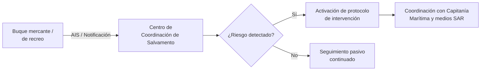

# PPER - Tema 3: Tráfico Marítimo, Eventos Náuticos y Salvamento

Un patrón profesional no navega solo: comparte agua con el tráfico mercante, puede tener que organizar o participar en regatas y concentraciones náuticas, y —a diferencia de un patrón particular ocasional— tiene un deber reforzado de conocer los protocolos de salvamento marítimo, porque es responsable de la seguridad de pasajeros que han pagado por confiar en su pericia.

---

## 1. Vigilancia y Seguimiento del Tráfico Marítimo

Los sistemas de seguimiento del tráfico marítimo permiten a la Administración conocer en tiempo real la posición, rumbo y características de los buques, con dos objetivos principales:
*   **Prevención de accidentes:** Especialmente en zonas de alta densidad de tráfico (Estrecho de Gibraltar, aproches a grandes puertos).
*   **Reacción ante emergencias:** Identificación rápida de buques que transportan mercancías peligrosas o contaminantes, y coordinación de la respuesta en caso de accidente o vertido.

Como patrón profesional, es relevante saber que:
*   Las embarcaciones de recreo, aunque no siempre estén obligadas a llevar AIS, deben **cumplir las instrucciones** de los servicios de tráfico marítimo cuando naveguen por dispositivos de separación de tráfico o zonas de fondeo obligatorio controladas.
*   En caso de mercancías peligrosas o accidente, la Administración marítima tiene potestad para **intervenir directamente** (incluida la orden de dirigirse a un lugar de refugio), potestad que prevalece sobre el criterio particular del patrón.

---

## 2. Seguridad en Concentraciones Náuticas Conmemorativas y Deportivas

La organización de regatas, desfiles náuticos, exhibiciones o cualquier concentración de embarcaciones con fines conmemorativos o deportivos requiere **autorización previa** de la Capitanía Marítima competente, que evalúa:
*   El plan de seguridad presentado por el organizador (zona acotada, embarcaciones de apoyo, protocolo de emergencia).
*   La compatibilidad del evento con el tráfico marítimo ordinario de la zona.
*   La cobertura de responsabilidad civil del evento en su conjunto.

> [!NOTE]
> Un patrón profesional que trabaje como patrón de una embarcación de apoyo o comité de regata debe conocer que su embarcación queda sujeta, durante el evento, tanto a la normativa general de navegación como a las **instrucciones específicas** dictadas en la autorización del evento (zona acotada, canal VHF de coordinación, velocidad máxima).

---

## 3. Búsqueda y Salvamento Marítimo Internacional

España participa en el sistema internacional de búsqueda y salvamento marítimo (SAR), coordinado a través de los Centros de Coordinación de Salvamento (CCS) y, en última instancia, del organismo público de Salvamento Marítimo.

### 3.1 Obligación de auxilio
El deber de prestar auxilio a cualquier persona en peligro en el mar es una obligación **universal**, recogida tanto en convenios internacionales como en la Ley de Navegación Marítima, y se aplica a todo patrón, particular o profesional, siempre que pueda hacerlo sin grave peligro para su propia embarcación y tripulación.

### 3.2 Especial responsabilidad del patrón profesional
Cuando el patrón profesional recibe una llamada de socorro (Mayday) o detecta una situación de peligro, debe:
1.  Comunicar de inmediato al Centro de Coordinación de Salvamento correspondiente (habitualmente vía Canal 16 VHF).
2.  Evaluar si está en condiciones de prestar auxilio directo, ponderando la seguridad de sus propios pasajeros (un factor añadido que no tiene el patrón particular sin pasaje a bordo).
3.  Seguir las instrucciones de coordinación del CCS una vez este asume la dirección de las operaciones, evitando así la concurrencia descoordinada de varias embarcaciones auxiliadoras.

### 3.3 Convenio de Salvamento y régimen de recompensa
El salvamento marítimo (asistencia a un buque en peligro con resultado útil) genera, conforme al Convenio Internacional de Salvamento y a la Ley de Navegación Marítima, un derecho a una **compensación económica** para quien presta el auxilio, distinta y compatible con el deber gratuito de salvar vidas humanas (el salvamento de vidas humanas nunca genera derecho a recompensa por sí solo; sí puede generarlo el salvamento del buque o su carga).

---

## Ejemplos Prácticos

**Caso 1: Regata sin autorización**
Un club náutico organiza una regata popular sin solicitar autorización previa a Capitanía Marítima, cortando de facto el paso habitual de embarcaciones en una bocana. ¿Qué consecuencias tiene esto para el patrón profesional contratado como comité de regata?

*Resolución:* El patrón profesional, al aceptar el encargo, asume una responsabilidad compartida si conocía o debía conocer la falta de autorización. La ausencia de autorización expone al organizador (y, en su caso, a los patrones implicados) a sanción administrativa, y deja sin cobertura clara el protocolo de emergencia que debería haberse coordinado con la Capitanía Marítima.

**Caso 2: Concurrencia de auxilio**
Varias embarcaciones de recreo, incluida una de chárter con pasaje a bordo patroneada por un PPER, escuchan simultáneamente un Mayday cercano. ¿Debe la embarcación de chárter acudir igualmente?

*Resolución:* El deber de auxilio es universal, pero el patrón profesional debe valorar si su presencia añade capacidad real de rescate y si puede prestarla sin poner en riesgo grave a su propio pasaje. Una vez el Centro de Coordinación de Salvamento asume la dirección y designa qué embarcaciones deben acudir, el patrón debe seguir esas instrucciones en lugar de actuar de forma descoordinada junto al resto de embarcaciones que respondieron a la llamada.

---

## Referencias

*   Normativa sobre vigilancia y control del tráfico marítimo. *(Verificar numeración exacta del RD vigente).*
*   Normativa sobre seguridad en concentraciones náuticas conmemorativas y pruebas náutico-deportivas. *(Verificar numeración exacta del RD vigente).*
*   Convenio Internacional sobre Búsqueda y Salvamento Marítimos (Convenio SAR, 1979) y Convenio Internacional de Salvamento (1989), ratificados por España.
*   Ley 14/2014, de Navegación Marítima (Título de asistencia, salvamento, hallazgos y extracciones marítimas).
