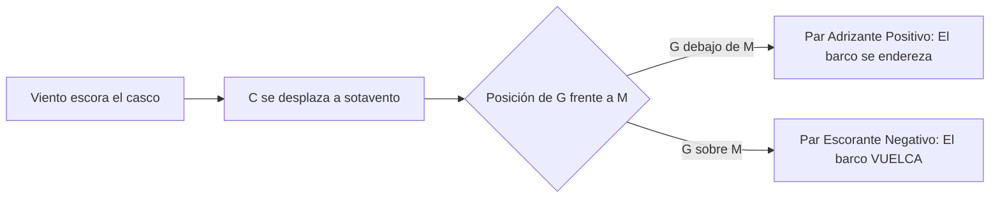

# Patrón de Yate - Tema 1: Seguridad y Estabilidad Avanzada

En travesías de altura (hasta 150 millas de la costa), la supervivencia del buque y de la tripulación recae al 100% sobre las decisiones tácticas del patrón y la integridad física del barco. No hay helicópteros que lleguen en 10 minutos.

---

## 1. Arquitectura y Estabilidad Transversal

La estabilidad es la propiedad de un barco para recuperar su posición de equilibrio (ponerse adrizado) cuando una fuerza externa (el viento o las olas) lo escora. Se rige por el equilibrio de dos fuerzas fundamentales.

### Fuerzas y Puntos Críticos (G, C, M)
*   **Principio de Arquímedes:** El casco sumergido desaloja un volumen de agua cuyo peso es igual al empuje vertical hacia arriba que experimenta el barco.
*   **Centro de Gravedad (G):** El punto teórico donde se concentra todo el Peso total del barco y su carga, actuando verticalmente hacia abajo.
    *   *Dinámica de G:* Si subes un peso a cubierta, G sube. Si gastas combustible de los tanques del fondo de la sentina, G sube (porque pierdes peso bajo). Si embarcas agua en la sentina, G baja (favorable) pero pierdes flotabilidad y creas "superficies libres" (muy peligroso).
*   **Centro de Carena (C):** El centro geométrico exacto del volumen de agua que el casco ha desplazado. Es donde se aplica la fuerza de Empuje, actuando hacia arriba.
    *   *Dinámica de C:* Cuando el barco escora, la forma del agujero que hace en el agua cambia. Por lo general, el volumen sumergido se desplaza hacia la banda de babor/estribor, así que C se mueve rápidamente hacia la banda escorada.
*   **Metacentro (M):** Al escorar un ángulo pequeño, si trazamos una línea vertical hacia arriba desde el nuevo Centro de Carena escorado, cruzará la línea central (crujía) del barco en un punto llamado Metacentro. Funciona como el punto de anclaje de un péndulo.

### El Par de Estabilidad y el Brazo Adrizante (GZ)
Cuando el viento escora el barco, G (que sigue en el medio) y el nuevo C (que se ha desplazado hacia el lateral sumergido) ya no están alineados verticalmente. Esto crea un par de fuerzas (un "volante" de rotación).

*   **Brazo Adrizante (GZ):** Es la distancia física horizontal entre el Centro de Gravedad y la vertical del Centro de Carena. Cuanto más grande sea GZ, más fuerza hará el barco para ponerse derecho.
*   **Condición de Equilibrio Estable:** El Metacentro (M) debe estar **POR ENCIMA** del Centro de Gravedad (G). Esto genera un par adrizante positivo.
*   **Condición de Equilibrio Inestable (Peligro de Vuelco):** Si G sube demasiado (llevas demasiada gente en el flybridge, exceso de pertrechos amarrados al techo de la cabina, depósitos bajos vacíos) y se coloca por encima de M, el par de fuerzas se invierte (Par Escorante) y empujará al barco a escorar aún más hasta dar la vuelta campana.

### El Peligro de las Superficies Libres
Si tienes un depósito de agua ancho a medio llenar (o agua embarcada moviéndose por el suelo de la cabina), al escorar el barco, toda esa agua corre hacia el lado bajo. Esto desplaza físicamente el Centro de Gravedad hacia ese lado de golpe, reduciendo dramáticamente el Brazo Adrizante (GZ) y pudiendo causar un vuelco instantáneo. Para evitarlo, los tanques llevan rompeolas internos (mamparos longitudinales).

> [!WARNING]
> La Regla de Oro del Patrón de Yate frente a temporales: **Bajar el Centro de Gravedad**. Trincar pertrechos pesados abajo en la sentina, vaciar depósitos altos, rellenar los bajos si es posible, y prohibir el acceso a la cubierta superior.

## 2. Abandono de Buque y Supervivencia

### ¿Cuándo abandonar?
La máxima del mar es clara: **"Jamás debes abandonar el barco hasta que el barco te abandone a ti (hundiéndose literalmente bajo tus pies)"**.
Se entra en la balsa salvavidas subiendo a ella, nunca bajando (es decir, el barco se ha hundido hasta el nivel del agua). ¿Por qué?
1. Un barco desarbolado o volcado a medias es infinitamente más visible desde el aire (aviones SAR) que una diminuta balsa naranja entre olas de 5 metros.
2. La balsa vuelca fácilmente, produce un frío letal, hacinamiento y mareos severos.
Solo se abandona prematuramente si hay un incendio incontrolable o riesgo inminente de explosión de gas.

### Zafas Hidrostáticas (Hammar H20)
La balsa salvavidas y la radiobaliza (EPIRB) deben instalarse en el exterior con zafas hidrostáticas y atadas al barco.
Si el barco se hunde en segundos y no da tiempo a soltarlas a mano, cuando la presión del agua alcanza los 2 a 4 metros de profundidad, una cuchilla corta automáticamente la trinca. La balsa/baliza sale flotando a la superficie. En el caso de la balsa, lleva una rabiza de disparo (painter line) unida al barco; al subir, pega el tirón, la balsa se infla, y un eslabón débil (weak link) rompe la rabiza para que el barco que se hunde no arrastre a la balsa al fondo.

### La Bolsa de Supervivencia (Grab Bag)
Aparte del kit que ya viene dentro de la balsa, en el barco debe haber un petate flotante y estanco listo para llevar:
*   VHF portátil GMDSS estanca.
*   Baterías de litio de repuesto precintadas.
*   Documentación (Pasaportes en bolsa zip).
*   Medicinas de la tripulación y Biodramina (el mareo extremo en balsa puede llevar a deshidratación fatal en 24h).
*   Gafas graduadas de repuesto.
*   Agua potable en envases flexibles y comida liofilizada extra.
*   Mantas térmicas, espejo de señales, linternas impermeables.

## 3. Dispositivos de Salvamento (Aparamenta Oficial)

### Material Pirotécnico
1.  **Bengalas de Mano (Rojas):** Uso exclusivo nocturno y a corta distancia. Duran unos 60 segundos. Se sostienen extendiendo el brazo a sotavento. Avisan a un buque de rescate que ya está a la vista.
2.  **Cohetes con Paracaídas (Rojos):** Uso diurno o nocturno para largo alcance (avisan a barcos tras el horizonte). Suben a 300 metros de altura y caen muy despacio. Visibles a 25-35 millas de noche. Disparar ligeramente a sotavento.
3.  **Botes de Humo (Naranjas):** Uso exclusivo diurno. Se tiran al agua. Crean una nube naranja densa durante 3 minutos. Ideales para que un helicóptero o avión localice el punto exacto y evalúe la dirección del viento en superficie.

### Chalecos Salvavidas (Lifejackets)
En la zona 2 (60 millas), se exigen chalecos autoinflables de 150 Newtons. Cuentan con un sensor de sal o pastilla celulósica que se disuelve al caer al agua, pinchando la bombona de CO2 en 5 segundos. Llevan silbato, luz intermitente automática y cintas reflectantes.

## 4. Equipo Radioeléctrico GMDSS / SMSSM

*   **EPIRB (Radiobaliza de 406 MHz):** Es la última línea de defensa. Al activarse (manualmente en cubierta o hidrostáticamente), envía un pulso continuo a los satélites polares COSPAS-SARSAT. El satélite triangula su posición por efecto Doppler y retransmite a la estación costera el código hexadecimal (MMSI) del barco, indicando nombre, modelo, eslora y contactos de emergencia (todo registrado en Capitanía). Modelos modernos integran GPS interno para enviar las coordenadas exactas de inmediato, con margen de error de pocos metros. Batería mínima: 48 horas.
*   **SART (Radar Transponder):** Llevado a la balsa. Responde de forma inteligente. Cuando una fragata de salvamento o un helicóptero SAR barren la zona con su radar de Navegación (Banda X, 9 GHz), el SART capta la radiación y emite una ráfaga. En la pantalla del radar del buque de rescate aparece instantáneamente una línea de 12 puntos o círculos gruesos que le marcan la Demora directa hacia ti. Batería: 96h en standby, 8h emitiendo a pleno rendimiento bajo interrogación.
