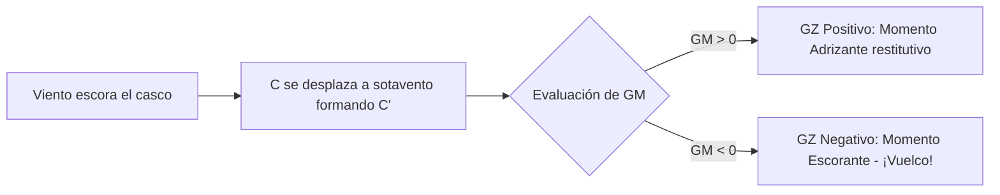
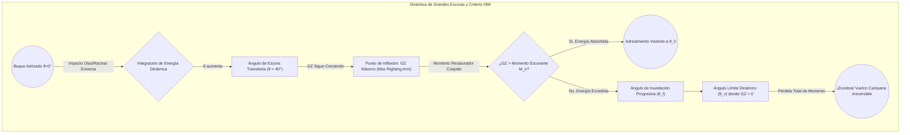

# Patrón de Yate - Tema 1: Seguridad y Estabilidad Avanzada (Nivel de Arquitectura Naval)

En travesías de altura (hasta 150 millas de la costa), la supervivencia del buque y de la tripulación recae al 100% sobre las decisiones tácticas del patrón y la integridad física del barco. No hay helicópteros que lleguen en 10 minutos. Es imprescindible que el patrón comprenda la teoría del buque a nivel de ingeniería para predecir el comportamiento dinámico del casco en la mar.

---

## 1. Arquitectura y Estabilidad Transversal: Fundamentos Matemáticos

La estabilidad es la propiedad intrínseca de un buque para recuperar su posición de equilibrio (adrizarse) tras ser escorado por una fuerza externa (viento o mar). Este principio obedece a las leyes fundamentales de la hidrostática de fluidos incompresibles.

### 1.1 Fuerzas y Puntos Críticos ($G, C, M$)

*   **Principio de Arquímedes y Desplazamiento ($\Delta$):** El casco sumergido desaloja un volumen de agua ($\nabla$) cuyo peso es igual al empuje vertical hacia arriba que experimenta el barco.
    $$ \Delta = \nabla \cdot \rho $$
    Donde $\rho$ es la densidad del agua de mar (aprox. $1.025 \text{ t/m}^3$). El Desplazamiento se mide en toneladas y es constante para un calado dado.

*   **Centro de Gravedad ($G$):** El punto teórico donde se concentra el sumatorio de pesos del buque y su carga. Actúa verticalmente hacia abajo. Sus coordenadas ($X_G, Y_G, Z_G$) respecto a las perpendiculares y línea base dictan el comportamiento estático.
    *   *Dinámica de $G$:* Si añadimos un peso $p$ a una altura $z$, el nuevo $KG'$ (altura de $G$ sobre la quilla $K$) se calcula ponderando momentos:
        $$ KG' = \frac{\Delta \cdot KG + p \cdot z}{\Delta + p} $$

*   **Centro de Carena ($C$ o $B$ - Center of Buoyancy):** El centroide geométrico del volumen de agua desplazado $\nabla$. Su altura sobre la quilla se denomina $KC$ o $KB$.
    *   *Dinámica de $C$:* Al escorar un ángulo $\theta$, el volumen sumergido cambia asimétricamente. El nuevo centro $C'$ se desplaza hacia la banda escorada.

*   **Metacentro Transversal ($M$):** Al escorar un ángulo infinitesimal $d\theta$, la nueva vertical de empuje que pasa por $C'$ interseca al plano diametral inicial en el punto $M$.

### 1.2 Radio Metacéntrico ($BM$) e Inercia de Flotación

La distancia entre el Centro de Carena y el Metacentro se denomina radio metacéntrico ($BM$). Según la hidrostática, este valor depende exclusivamente del momento de inercia de la superficie de flotación respecto al eje longitudinal ($I_L$) y del volumen de carena ($\nabla$).
$$ BM = \frac{I_L}{\nabla} $$
Por lo tanto, la altura del Metacentro sobre la quilla ($KM$) es un parámetro que depende únicamente del calado y de las formas del casco:
$$ KM = KB + BM $$

### 1.3 Altura Metacéntrica ($GM$) y Par Adrizante

El parámetro fundamental de estabilidad inicial (para escora $\theta < 10^\circ$) es la Altura Metacéntrica Inicial ($GM$), distancia entre $G$ y $M$.
$$ GM = KM - KG $$

Cuando el viento escora el barco un ángulo $\theta$, $G$ (invariable) y $C'$ (desplazado) generan un par de fuerzas. La distancia horizontal entre las verticales de $G$ y $C'$ es el **Brazo Adrizante ($GZ$)**.
Para ángulos pequeños, la fórmula del brazo adrizante es:
$$ GZ = GM \cdot \sin(\theta) $$

El **Momento Adrizante ($M_A$)** se define como:
$$ M_A = \Delta \cdot GZ = \Delta \cdot GM \cdot \sin(\theta) $$

*   **Equilibrio Estable:** $GM > 0$ (M por encima de G). El par $M_A$ es restitutivo y endereza el barco.
*   **Equilibrio Inestable:** $GM < 0$ (G por encima de M). El par se convierte en momento escorante, volcando el barco hasta encontrar un ángulo de equilibrio transversal o zozobrar (dar la vuelta campana).
*   **Equilibrio Indiferente:** $GM = 0$. El buque se queda en la escora inicial inducida sin fuerza para recuperarse.

## 2. Estabilidad Dinámica y a Grandes Ángulos (Curvas de Atwood y Moseley)

Para escoras grandes ($\theta > 10^\circ$), el Metacentro ya no se mantiene fijo en el eje, describiendo la curva evoluta metacéntrica. Se usa la **Fórmula de Atwood** para calcular $GZ$ de forma exacta:
$$ GZ = \frac{v \cdot h}{\nabla} - BG \cdot \sin(\theta) $$
Donde $v \cdot h$ es el momento de traslación de las cuñas de emersión/inmersión.

La representación de $GZ$ en función de $\theta$ conforma la **Curva de Estabilidad Estática Transversal**.

### 2.1 Estabilidad Dinámica ($E_D$) y el Criterio Meteorológico de Rahola

Es el trabajo físico que realiza el par adrizante, o bien la energía requerida por fuerzas externas (rachas de viento, olas rompientes) para escorar el buque hasta un ángulo $\theta$. Se calcula integrando el Momento Adrizante respecto al ángulo de escora, lo cual equivale matemáticamente al área bajo la curva $GZ$.
$$ E_D = \Delta \cdot \int_{0}^{\theta} GZ \, d\theta $$

Esta energía representa la reserva termodinámica del buque para absorber impactos de oleaje percusivo sin exceder el Ángulo Límite de Inundación ($\theta_f$) o el Ángulo de Zozobra ($\theta_v$). El conocimiento de esta energía es crítico para certificar la supervivencia de un yate frente a rachas de viento violentas según el criterio de la OMI (IMO Res. A.749). El famoso **Criterio Meteorológico (Severe Wind and Rolling Criterion)** exige que el área bajo la curva GZ entre el ángulo de equilibrio estático ($\theta_0$) y el de inundación progresiva sea sustancialmente mayor (típicamente $\ge 0.030$ m-rad) que el área generada por un momento escorante provocado por una ráfaga racheada extrema.

### 2.2 El Peligro de las Superficies Libres

Si en el buque hay líquidos con superficie libre (tanques a medio llenar o sentinas inundadas), al escorar, el líquido se trasiega hacia la banda baha. Esto genera un par transversal que reduce artificialmente la altura metacéntrica efectiva.
La reducción virtual del GM se calcula mediante:
$$ \Delta GM = \frac{\rho_L \cdot i_L}{\rho_C \cdot \nabla} $$
Donde $i_L$ es el momento de inercia de la superficie libre del tanque, $\rho_L$ la densidad del líquido del tanque, y $\rho_C$ la densidad del agua de mar.
Para mitigar este efecto exponencial, es imprescindible el uso de **mamparos rompeolas longitudinales** que fragmentan la inercia $i_L$.

> [!CAUTION]
> Regla de Arquitectura Naval del PY: **Minimizar $KG$ y anular las superficies libres.** Trincar pesos bajos y llenar o vaciar completamente los tanques antes de enfrentar temporales cruzados.

## 3. Abandono de Buque y Dispositivos de Supervivencia GMDSS

El rigor de la supervivencia depende de aplicar estrictamente los protocolos y dominar los sistemas radioeléctricos modernos.

### 3.1 Criterio de Abandono (El "Punto de No Retorno")
**"Jamás debes abandonar el barco hasta que el barco te abandone a ti."** Se entra a la balsa subiendo a ella, cuando el mar ya alcanza la cubierta. El casco invertido sigue siendo el blanco radárico (RCS) y visual óptimo, mientras que una balsa es diminuta en un estado de mar Douglas 7. Solo el fuego incontrolable u hundimiento inminente (pérdida de flotabilidad de reserva) justifica la activación prematura.

### 3.2 Zafas Hidrostáticas (Principio de Funcionamiento)
Los modelos tipo Hammar H20 operan basándose en la presión de la columna de agua. Al sumergirse entre 2 y 4 metros, un diafragma cede venciendo un resorte de tarado de presión, disparando una guillotina o mecanismo que corta la trinca.
La balsa asciende por flotabilidad positiva. La *rabiza de disparo* unida al barco da el tirón para la inflación por la botella de $CO_2/N_2$. Un *weak link* (eslabón débil con carga de rotura de $2.2 \pm 0.4 \text{ kN}$) se parte posteriormente, impidiendo que el buque que zozobra arrastre la balsa abierta hacia el fondo abisal.

### 3.3 Bolsa de Supervivencia (Grab Bag)
Adicional al SOLAS pack de la balsa, se porta:
*   VHF portátil GMDSS estanca.
*   Baterías de litio no recargables.
*   Documentación, pasaportes, EPIRB personal.
*   Biodramina y medicina táctica. (El mareo grave acelera la deshidratación e hipotermia, pudiendo inducir un shock en 24-48 horas).

### 3.4 Pirotecnia y Salvamento Activo
*   **Bengalas rojas:** Señalización final. $\sim 15.000 \text{ candelas}$, 60 segundos. Empuñadas a sotavento, indicando posición a un medio de rescate visualizado.
*   **Cohetes con paracaídas rojas:** Suben $\sim 300 \text{ m}$ quemando a $\sim 30.000 \text{ candelas}$. Velocidad de descenso $< 5 \text{ m/s}$. Rango de 25-35 millas.
*   **Botes de humo naranjas:** Expansión pirotécnica diurna. $\sim 3 \text{ min}$. Facilita la referenciación del viento relativo al piloto del helo de salvamento SAR.

### 3.5 Equipamiento Radioeléctrico GMDSS/SMSSM Avanzado
*   **EPIRB (406 MHz):** Radiobaliza de localización de siniestros. La portadora principal a $406.025 \text{ MHz}$ es interceptada por constelaciones LEOSAR (COSPAS-SARSAT), MEOSAR (Galileo/GPS) y GEOSAR. Envía el código hexadecimal de 15 dígitos que engloba el MID (país) y MMSI del yate, junto con las coordenadas obtenidas del GNSS interno. Precisión < 100 metros. También emiten balizamiento homing en $121.5 \text{ MHz}$.
*   **SART (Búsqueda y Rescate Respondedor de Radar):** Transpondedor de Banda X (9.2 - 9.5 GHz). Al recibir el barrido del radar de navegación del rescatador, el SART transmite una respuesta de frecuencia de barrido rápido. Resulta en una línea radial de 12 arcos concéntricos en la pantalla del radar del buque de búsqueda, apuntando ineludiblemente a la posición de los náufragos.

## Ejemplos Prácticos

**Problema 1: Desplazamiento del Centro de Gravedad y Ángulo de Escora Permanente**
Un yate de desplazamiento $\Delta = 120\text{ t}$, $KM = 3.5\text{ m}$ y $KG = 2.8\text{ m}$, sufre una avería que le obliga a bombear $15\text{ t}$ de agua de sentina ($KG_{\text{agua}} = 0.5\text{ m}$) por la borda y además debe izar una embarcación auxiliar de $2.5\text{ t}$ a la cubierta superior ($KG_{\text{aux}} = 5.2\text{ m}$), desplazándola simétricamente $3\text{ m}$ a estribor de la crujía. Calcule el nuevo ángulo de escora permanente en situación de equilibrio.

*Resolución:*
1.  **Cálculo del GM inicial:**
    $$ GM_0 = KM - KG = 3.5\text{ m} - 2.8\text{ m} = 0.70\text{ m} $$
2.  **Cálculo del nuevo Desplazamiento ($\Delta'$):**
    $$ \Delta' = 120\text{ t} - 15\text{ t} + 2.5\text{ t} = 107.5\text{ t} $$
3.  **Cálculo del nuevo $KG'$ ponderando momentos verticales:**
    $$ KG' = \frac{(120 \cdot 2.8) - (15 \cdot 0.5) + (2.5 \cdot 5.2)}{107.5} = \frac{336 - 7.5 + 13}{107.5} \approx 3.176\text{ m} $$
4.  **Cálculo del nuevo $GM'$:**
    Asumiendo que $KM$ varía de forma infinitesimal (aproximación isocarena):
    $$ GM' \approx 3.5\text{ m} - 3.176\text{ m} = 0.324\text{ m} $$
5.  **Cálculo del momento escorante transversal ($M_{\text{escorante}}$):**
    El único peso desplazado transversalmente es la auxiliar ($2.5\text{ t}$ a $3\text{ m}$):
    $$ M_{\text{escorante}} = P \cdot y = 2.5\text{ t} \cdot 3\text{ m} = 7.5\text{ t}\cdot\text{m} $$
6.  **Cálculo del ángulo de escora ($\theta$):**
    En equilibrio, $M_{\text{adrizante}} = M_{\text{escorante}}$.
    $$ \Delta' \cdot GM' \cdot \sin(\theta) \approx \Delta' \cdot GM' \cdot \tan(\theta) = 7.5 $$
    $$ \tan(\theta) = \frac{7.5}{107.5 \cdot 0.324} = \frac{7.5}{34.83} \approx 0.2153 $$
    $$ \theta = \arctan(0.2153) \approx 12.15^\circ \text{ a Estribor} $$

**Problema 2: Impacto del Trasegado de Líquidos y Superficie Libre Dinámica en Condiciones Baroclínicas Severas**
Un buque de expedición transoceánica tiene un Desplazamiento ($\Delta$) de $350\text{ t}$ y un $GM$ inicial de $0.95\text{ m}$. Durante un cruce en el Paso de Drake (Estado de la Mar 8), un tanque rectangular de lastre a babor se avería. Las dimensiones de la superficie del tanque son: eslora ($l = 8\text{ m}$), manga ($b = 4\text{ m}$). El tanque contiene agua salada ($\rho = 1.025\text{ t/m}^3$) y su superficie no está restringida por mamparos rompeolas. Adicionalmente, el trasvase asimétrico genera un momento escorante transversal de $45\text{ t}\cdot\text{m}$.
Calcule la pérdida virtual del $GM$ debida al efecto de superficie libre, el nuevo $GM$ efectivo ($GM_{\text{eff}}$), y el ángulo de escora resultante, evaluando si el buque conserva viabilidad para resistir la mar gruesa ($GM_{\text{eff}} > 0.15\text{ m}$ criterio mínimo OMI).

*Resolución:*
1.  **Cálculo del Momento de Inercia Transversal del tanque ($i_L$):**
    Para un tanque de base rectangular, el momento de inercia de la superficie libre respecto al eje longitudinal central del tanque es:
    $$ i_L = \frac{l \cdot b^3}{12} = \frac{8 \cdot 4^3}{12} = \frac{8 \cdot 64}{12} = 42.667\text{ m}^4 $$
2.  **Cálculo de la Reducción Virtual de la Altura Metacéntrica ($\Delta GM$):**
    Dado que el buque navega en agua salada y el tanque contiene agua salada, la densidad del líquido ($\rho_L$) es igual a la del mar ($\rho_C$). Por tanto, la corrección es puramente volumétrica.
    Volumen de carena del buque ($\nabla$):
    $$ \nabla = \frac{\Delta}{\rho_C} = \frac{350}{1.025} \approx 341.46\text{ m}^3 $$
    La pérdida virtual de $GM$ es:
    $$ \Delta GM = \frac{\rho_L \cdot i_L}{\rho_C \cdot \nabla} = \frac{i_L}{\nabla} = \frac{42.667}{341.46} \approx 0.125\text{ m} $$
3.  **Cálculo del Nuevo $GM$ Efectivo ($GM_{\text{eff}}$):**
    $$ GM_{\text{eff}} = GM_{\text{inicial}} - \Delta GM = 0.95 - 0.125 = 0.825\text{ m} $$
    *El $GM_{\text{eff}}$ sigue siendo muy superior al umbral de $0.15\text{ m}$, el buque no zozobrará inmediatamente por inestabilidad elástica.*
4.  **Cálculo de la Escora Inducida por el Par Asimétrico:**
    Bajo el nuevo $GM$ efectivo, se aplica el momento de $45\text{ t}\cdot\text{m}$.
    $$ \tan(\theta) = \frac{M_{\text{escorante}}}{\Delta \cdot GM_{\text{eff}}} = \frac{45}{350 \cdot 0.825} = \frac{45}{288.75} \approx 0.1558 $$
    $$ \theta = \arctan(0.1558) \approx 8.86^\circ $$
    *Conclusión: A pesar del efecto de superficies libres, la arquitectura del casco absorbe el evento con una escora final asumible de casi 9 grados.*

**Problema 3: Integración de la Estabilidad Dinámica con la Ecuación Evoluta de Atwood**
Para el mismo buque anterior de $\Delta = 350\text{ t}$, en un ángulo de escora crítico de $\theta = 35^\circ$, el análisis integral de las carenas inclinadas revela que el volumen de la cuña de inmersión traslada su centroide generando un momento volumétrico ($v \cdot h$) de $1150\text{ m}^4$. Si la altura del centro de gravedad sobre el de carena inicial es $BG = 1.8\text{ m}$, calcule mediante la fórmula exacta de Atwood el Brazo Adrizante ($GZ$) y el Momento Adrizante ($M_A$) a ese ángulo, para determinar si el buque ha superado su límite de recuperación termodinámica (donde la pendiente de GZ se invierte).

*Resolución:*
1.  **Evaluación de la Fórmula de Moseley / Atwood:**
    $$ GZ = \frac{v \cdot h}{\nabla} - BG \cdot \sin(\theta) $$
2.  **Sustitución en el marco no lineal ($\theta = 35^\circ$):**
    Recordando $\nabla = 341.46\text{ m}^3$ y $\sin(35^\circ) \approx 0.5736$:
    $$ GZ = \frac{1150}{341.46} - 1.8 \cdot 0.5736 $$
    $$ GZ \approx 3.368 - 1.032 = 2.336\text{ metros} $$
3.  **Cálculo del Momento Adrizante Restaurador a Grandes Escoras:**
    $$ M_A = \Delta \cdot GZ = 350\text{ t} \cdot 2.336\text{ m} = 817.6\text{ t}\cdot\text{m} $$
    *Conclusión Geométrica:* El buque opone una resistencia formidable de más de 800 toneladas-metro en este ángulo, indicando que el pico de la Curva GZ de Estabilidad Dinámica aún es positivo y el casco reaccionará violentamente para adrizarse tras el impacto de una ola rompiente masiva.

## Referencias Bibliográficas y Jurisprudencia

*   **Doctrina Académica:**
    *   *Basic Ship Theory, Volume 1* (Rawson & Tupper). Capítulo 3: "Transverse Stability". Edición Longman.
    *   *Ship Stability for Masters and Mates* (C.B. Barrass & D.R. Derrett). Elsevier.
*   **Convenios IMO:**
    *   **IMO Res. A.749(18):** Código de Estabilidad Intacta para todos los buques regidos por la OMI (Revisión de la curva de brazos adrizantes $GZ$).
    *   **SOLAS 1974 (Enmendado), Capítulo III:** Dispositivos y Medios de Salvamento (Especificaciones técnicas GMDSS y zafas hidrostáticas).
*   **Jurisprudencia Almirantazgo:**
    *   *The "Toledo" (1995) 1 Lloyd's Rep 40:* Fallo sobre la negligencia en la evaluación del GM y la carga asimétrica con resultado de pérdida de buque por zozobra en mar gruesa.
    *   *The "Herald of Free Enterprise" (1987) R v. Stanley y otros:* Caso fundamental en el derecho marítimo anglosajón, subrayando la responsabilidad penal del capitán y naviera al permitir superficies libres (agua en la cubierta Ro-Ro) que anularon el Momento Adrizante, provocando un vuelco fulminante.
