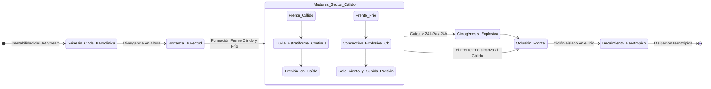

# Patrón de Yate - Tema 2: Meteorología Avanzada y Dinámica Atmosférica (Escala Sinóptica y Frontogénesis)

Para el Patrón de Yate de Altura, la meteorología trasciende la simple lectura de un parte. Implica la interpretación científica de mapas de geopotencial, análisis sinópticos y el conocimiento de la dinámica atmosférica del nivel de tropopausa para anticipar la génesis explosiva de borrascas.

---

## 1. La Atmósfera, Termodinámica y Ecuación de Estado

La atmósfera actúa como un fluido compresible cuyo comportamiento termodinámico está gobernado por la **Ley de los Gases Ideales**.

*   **Ecuación de Estado Atmosférico:**
    $$ P = \rho \cdot R_d \cdot T $$
    Donde $P$ es la presión (Pa), $\rho$ es la densidad del aire, $R_d$ la constante específica del aire seco ($287.05 \text{ J/kg}\cdot\text{K}$) y $T$ la temperatura absoluta en Kelvin.
*   **Presión Atmosférica Estándar (ISA):** $1013.25 \text{ hPa}$ a nivel medio del mar, con un gradiente térmico de $-6.5^\circ\text{C}$ cada $1000 \text{ metros}$.

### 1.1 Humedad y Procesos Adiabáticos
La cantidad de vapor de agua depende de la presión de vapor de saturación ($e_s$), regida por la ecuación de Clausius-Clapeyron, lo que implica que el aire cálido admite exponencialmente más vapor de agua.
*   **Punto de Rocío ($T_d$):** La temperatura termodinámica a la que una parcela de aire de humedad específica constante debe ser enfriada isobáricamente para saturarse ($RH = 100\%$).
*   **Psicrometría:** Un termómetro seco y otro húmedo. La depresión psicrométrica permite determinar la humedad mediante la ecuación: $e = e_w - A \cdot P \cdot (T - T_w)$.

## 2. Dinámica del Viento y Ecuaciones del Movimiento Atmosférico

El viento no es solo aire moviéndose de la alta a la baja; es el balance complejo de múltiples fuerzas vectoriales en un sistema de coordenadas en rotación. La aceleración de una parcela de aire está dictada por la ecuación del momento de Navier-Stokes simplificada:

$$ \frac{d\vec{V}}{dt} = -\frac{1}{\rho}\vec{\nabla}P - 2\vec{\Omega} \times \vec{V} + \vec{g} + \vec{F}_r $$

1.  **Fuerza del Gradiente de Presión ($-\frac{1}{\rho}\vec{\nabla}P$):** Empuja el aire perpendicular a las isobaras, desde la Alta a la Baja.
2.  **Fuerza de Coriolis ($-2\vec{\Omega} \times \vec{V}$):** Aceleración aparente por la rotación del planeta ($\Omega$). Desvía el flujo $90^\circ$ a la derecha del movimiento en el Hemisferio Norte.
3.  **Fuerza de Fricción ($\vec{F}_r$):** Efecto de la capa límite planetaria sobre la superficie oceánica.

### 2.1 Viento Geostrófico y Viento del Gradiente
A niveles superiores de la atmósfera ($\sim 500 \text{ hPa}$), la fricción es despreciable ($\vec{F}_r = 0$). Cuando el flujo alcanza el estado estacionario y isobaras rectas, la fuerza del gradiente equilibra exactamente a Coriolis. Este es el **Viento Geostrófico ($V_g$)**, que fluye paralelo a las isobaras:
$$ V_g = \frac{1}{\rho \cdot f} \cdot \frac{\partial P}{\partial n} $$
Donde $f = 2\Omega\sin(\phi)$ es el parámetro de Coriolis (siendo $\phi$ la latitud) y $\frac{\partial P}{\partial n}$ el gradiente de presión.

### 2.2 Viento de Superficie y Espiral de Ekman
En contacto con el mar, la fricción aerodinámica reduce la velocidad del viento $V$. Al caer $V$, la fuerza de Coriolis disminuye, y el equilibrio se rompe. La Fuerza del Gradiente prevalece, arrastrando al viento hacia el centro de las bajas presiones cruzando las isobaras un ángulo $\alpha$ (de 15º a 30º).

> [!TIP]
> **Ley de Buys-Ballot Rigurosa:** En el Hemisferio Norte, enfrentando el viento real en superficie, la baja presión se sitúa a tu derecha y retrasada un ángulo de unos $100^\circ - 110^\circ$.

## 3. Borrascas Extratropicales, Frontogénesis y el Modelo Noruego

El clima de latitudes medias está dictado por las ondas de Rossby y el Chorro Polar (Jet Stream). Las borrascas nacen por inestabilidad baroclínica en zonas de fuerte gradiente térmico horizontal (Frente Polar).

### 3.1 Ciclogénesis y Frontogénesis
La ciclogénesis (formación de una depresión de origen dinámico) ocurre cuando hay **divergencia en altura** (en la tropopausa, a menudo en la rama de salida izquierda del Jet Stream). El aire extraído por arriba succiona el aire de abajo, desplomando la presión en superficie e incitando la circulación ciclónica.
Si el mecanismo es violento, ocurre una **Ciclogénesis Explosiva** ("Bomba Meteorológica"): una caída de la presión central de $\geq 24 \text{ hPa}$ en 24 horas.

### 3.2 Anatomía del Sistema Frontal

El Modelo Noruego clásico describe la evolución de un ciclón extratropical:

1.  **Frente Cálido:** Masa de aire cálido tropical marítimo ascendiendo suavemente sobre el aire polar frío, formando una cuña oblicua.
    *   *Secuencia nubosa:* Cirros (Ci) a $> 8 \text{ km}$, seguidos de Cirrostratos (Cs, generan halo), Altostratos (As), y Nimbostratos (Ns).
    *   *Meteoro:* Precipitaciones continuas, llovizna densa, caída sostenida del barómetro.
2.  **Sector Cálido:** Región húmeda inter-frontal. Cese de precipitación intensa, formación de nubes rasas (Estratos y estratocúmulos), neblinas, viento racheado pero constante, y barómetro en estancamiento.
3.  **Frente Frío:** El aire polar incide bruscamente por detrás como una cuña pesada e hiperdensa. Su pendiente geopotencial es muy abrupta (1:50 a 1:100), forzando ascensos convectivos extremos y adiabáticos del aire del sector cálido prefrontal.
    *   *Inestabilidad Termodinámica:* Tormentas multicelulares y cumulonimbos (Cb) severos, fuerte cizalladura del viento direccional y de velocidad (shear), turbulencia grave, aparato eléctrico intenso y chaparrones granizados con micro-reventones (microbursts).
    *   *El Role Baroclínico:* El viento cambia repentinamente del SO al NO (paso frontal). La temperatura termodinámica se desploma y el barómetro registra un "salto" isalobárico positivo (ascenso súbito).
4.  **Frente Ocluido:** El frente frío, desplazándose más rápido en la troposfera inferior, alcanza y canibaliza al frente cálido, elevando el sector cálido por completo separándolo del suelo oceánico. Este proceso estrangula el gradiente térmico de la borrasca, marcando el comienzo del decaimiento estructural del sistema ciclónico (proceso de barotropización y decaimiento oclusivo).
    *   *Tipos:* Oclusión de frente cálido y de frente frío, dependiendo de la retro-temperatura de las masas polares subyacentes.

## 4. Estado de la Mar (Teoría del Espectro Direccional)

La interacción aire-mar genera oleaje, gobernado por transferencia de momento.
La altura significativa de las olas ($H_s$, promedio del tercio más alto) es función de:
$$ H_s \propto f(V_{\text{viento}}, F, T_d) $$
Donde $F$ es el **Fetch** (distancia libre de obstáculos), y $T_d$ es la **Duración** del soplo ininterrumpido. Un mar se considera "completamente desarrollado" cuando el viento no puede añadirle más energía y se ha alcanzado la saturación espectral (Ecuación de Pierson-Moskowitz).

*   **Mar de Viento (Sea):** Olas asimétricas, periodo corto, y con longitud de onda corta ($\lambda$), altamente escarpadas. Frecuentemente presentan crestas rompientes (whitecaps).
*   **Mar de Fondo (Swell):** Ondas de gravedad libres que escapan de la zona generadora. Debido a la dispersión de fase profunda, adoptan formas sinusoidales puras, de gran longitud de onda ($\lambda > 150\text{ m}$) y periodos largos ($T > 10\text{ s}$). Viajan sin pérdida casi de energía a velocidades proporcionales a su periodo ($C \approx 1.56 \cdot T$ en metros/segundo).

### 4.1 Escalas y Mediciones Marítimas
*   **Escala Douglas:** Mide la topografía superficial en niveles de 0 a 9. Grado 4 (Marejada, 1.25 a 2.5m). Grado 8 (Mar muy arbolada, 9 a 14m).
*   **Escala de Beaufort:** Estima empírica de velocidad de viento a $10 \text{ m}$ sobre la superficie, calibrada por Sir Francis Beaufort. Relación general: $V \approx 0.836 \cdot B^{3/2} \text{ [m/s]}$.
    *   *F6 (22-27 kn):* Formación extensa de rociones espumosos blancos.
    *   *F8 (34-40 kn):* Temporal fresco, espuma volando en estrías prominentes.

## 5. Dinámica de Nieblas Marítimas

Las nieblas suponen una reducción de la visibilidad a $< 1 \text{ km}$. Las colisiones de buques se producen por su naturaleza insidiosa de atenuación de luz y dispersión acústica (scattering).

*   **Niebla de Advección (Enfriamiento Diabático):** Requiere vientos flojos pero constantes que desplacen masas de aire cálido y húmedo sobre corrientes oceánicas gélidas (Ej. Grand Banks, costa cantábrica en verano). El contacto rebaja $T$ hasta el $T_d$, condensando espesos mantos estratiformes que la radiación solar no disipa fácilmente (alta refracción albedo).
*   **Niebla de Radiación:** Formación radiativa nocturna bajo cielos rasos anticiclónicos. En rías o puertos cerrados. El calor de la superficie terrestre escapa en la banda infrarroja de onda larga ($> 4 \mu m$), provocando una marcada Inversión Térmica en superficie, atrapando el vapor condensado cerca del mar. Típicamente disipada tras unas horas de insolación matutina.

## 6. Lectura Práctica de un Mapa Isobárico (Análisis Sinóptico de Examen)

Más allá de la ecuación del viento geostrófico (apartado 2.1), el examen del PY exige interpretar visualmente un mapa de superficie (el que emite AEMET, el Met Office o el NWS) en segundos. El procedimiento se reduce a cuatro pasos sistemáticos:

1.  **Localizar los centros de presión:** identificar las letras **A** (anticiclón, alta presión) y **B** (borrasca, baja presión) y sus valores centrales en hPa.
2.  **Determinar el sentido de giro (Ley de Buys-Ballot):** en el Hemisferio Norte, el viento circula en sentido **horario y divergente** alrededor de un A, y en sentido **antihorario y convergente** alrededor de una B. Regla práctica: de espaldas al viento, la Baja queda a la izquierda; de cara al viento, a la derecha (con un ángulo de $10^\circ$-$30^\circ$ hacia el centro por la fricción de superficie, ver apartado 2.2).
3.  **Medir el gradiente de presión (separación de isobaras):** isobaras muy juntas (el "collado" entre un A y una B) indican viento fuerte; isobaras muy separadas (centro de un anticiclón) indican viento flojo o calma.
4.  **Identificar los frentes por su simbología estándar OMI:** línea con **triángulos azules** apuntando en la dirección de avance = frente frío; línea con **semicírculos rojos** = frente cálido; línea que alterna ambos símbolos en color morado = frente ocluido.

| Símbolo | Tipo de frente | Meteoro asociado al paso |
| :--- | :--- | :--- |
| Triángulos azules | Frío | Turbonada breve y violenta, chubascos, rolada brusca del viento, mejora rápida posterior |
| Semicírculos rojos | Cálido | Lluvia fina y persistente, visibilidad reducida, barómetro en descenso lento y sostenido |
| Alternancia morada | Ocluido | Combinación de ambos, sistema en fase de decaimiento |

> [!NOTE]
> Este resumen es autocontenido para el examen. Para el desarrollo completo con ejemplo gráfico paso a paso sobre un mapa real del Atlántico Norte, consulta **[METEOROLOGIA.md, sección 7 "Cómo Leer un Mapa Isobárico"](../../METEOROLOGIA.md#7-cómo-leer-un-mapa-isobárico-paso-a-paso)**.

## 7. Corrientes Oceánicas Principales

Además del oleaje de viento local, el patrón de altura debe conocer los grandes sistemas de corrientes superficiales permanentes, generados por el arrastre sostenido de los vientos planetarios (alisios, vientos del oeste) y desviados por el efecto Coriolis (Espiral y Transporte de Ekman: el flujo neto de agua se desvía unos $90^\circ$ a la derecha del viento en el Hemisferio Norte). Su desconocimiento en el planeamiento de una travesía de 150 millas puede suponer horas de retraso o consumo de combustible extra al navegar en contra.

| Corriente | Zona | Sentido / Régimen | Relevancia para el PY |
| :--- | :--- | :--- | :--- |
| **Corriente del Golfo (Gulf Stream)** | Costa Este de EE.UU. hacia Europa (Atlántico Norte) | Cálida, hasta 4 nudos | Genera mar muy dura y peligrosa cuando el viento sopla en contra de la corriente (wind-against-current) |
| **Corriente de Canarias** | Costa Atlántica de la Península hacia Canarias | Fría, procedente del Atlántico Norte, débil (~0.5-1 nudo) hacia el SO | Afecta a travesías Península-Canarias; favorable en ese sentido |
| **Corriente del Labrador** | Atlántico Norte, frente a Terranova | Fría, hacia el Sur | Contribuye a la niebla de advección de los Grandes Bancos (ver apartado 5) |
| **Corriente Circumpolar Antártica** | Rodea la Antártida sin interrupción de tierra | Impulsada por los vientos del oeste (Cuarenta Rugientes) | Relevante solo en travesías oceánicas de gran altura, mencionada para contexto |
| **Corriente de Canal / Mareal del Estrecho de Gibraltar** | Estrecho de Gibraltar | Superficial entrante (Atlántico → Mediterráneo, ~2-4 nudos) y profunda saliente | La más relevante en el examen práctico sobre la Carta 105: debe combinarse vectorialmente con la corriente de marea semidiurna |

> [!TIP]
> **Efecto "viento contra corriente":** cuando el viento sopla en sentido opuesto a una corriente fuerte (típico en el Golfo de Cádiz con levante duro contra la corriente entrante de Gibraltar), la ola se hace más corta, empinada y rompiente que lo que indicaría el Beaufort por sí solo. Es una pregunta recurrente de examen relacionar este efecto con el estado de la mar del apartado 4.

## Ejemplos Prácticos

**Problema 1: Cálculo del Viento Geostrófico de Altura**
Un yate navega a latitud $\phi = 45^\circ\text{ N}$. Un análisis sinóptico de la isohipsa de $500\text{ hPa}$ revela un gradiente de presión transversal de $\Delta P = 8\text{ hPa}$ en una distancia de $200\text{ km}$. Sabiendo que la densidad del aire en ese nivel es $\rho \approx 0.65\text{ kg/m}^3$ y la velocidad angular de la Tierra $\Omega = 7.292 \times 10^{-5}\text{ rad/s}$, calcule la magnitud teórica del Viento Geostrófico ($V_g$).

*Resolución:*
1.  **Cálculo del parámetro de Coriolis ($f$):**
    $$ f = 2 \Omega \sin(\phi) = 2 \cdot (7.292 \times 10^{-5}) \cdot \sin(45^\circ) $$
    $$ f \approx 2 \cdot (7.292 \times 10^{-5}) \cdot 0.7071 \approx 1.031 \times 10^{-4}\text{ s}^{-1} $$
2.  **Conversión de unidades del Gradiente de Presión:**
    $$ \Delta P = 8\text{ hPa} = 800\text{ Pa (N/m}^2) $$
    $$ \Delta n = 200\text{ km} = 200,000\text{ m} $$
    $$ \frac{\partial P}{\partial n} \approx \frac{\Delta P}{\Delta n} = \frac{800}{200,000} = 0.004\text{ Pa/m} $$
3.  **Cálculo del Viento Geostrófico:**
    $$ V_g = \frac{1}{\rho \cdot f} \frac{\partial P}{\partial n} $$
    $$ V_g = \frac{1}{0.65 \cdot 1.031 \times 10^{-4}} \cdot 0.004 $$
    $$ V_g = \frac{0.004}{6.7015 \times 10^{-5}} \approx 59.68\text{ m/s} $$
4.  **Conversión a nudos ($1\text{ m/s} = 1.94384\text{ nudos}$):**
    $$ V_g \text{ (kn)} = 59.68 \cdot 1.94384 \approx 116\text{ nudos} $$
    *(Un valor indicativo de una corriente en chorro severa en la capa media).*

**Problema 2: Altura Significativa de Oleaje mediante Análisis Espectral de Esfuerzo de Corte**
Durante el tránsito del huracán monzónico sobre la cuenca del Atlántico Norte, el viento de superficie registrado ($U_{10}$) se sostiene a $25\text{ m/s}$ a $10\text{ metros}$ sobre el nivel del mar. La transferencia de momento aerodinámico responde a una tensión tangencial (esfuerzo cortante del viento) $\tau = \rho_{\text{aire}} \cdot C_D \cdot U_{10}^2$. Suponga que la densidad del aire en la frontera marina húmeda es $\rho_{\text{aire}} = 1.22\text{ kg/m}^3$ y el coeficiente empírico de arrastre es $C_D = 2.0 \times 10^{-3}$.
El modelo de ola totalmente desarrollada empírico (Límite de Pierson-Moskowitz) estima que la altura significativa de ola ($H_s$) es proporcional a la energía transferida según la aproximación simplificada en estas condiciones de extremo Fetch:
$$ H_s = \frac{0.22 \cdot U_{10}^2}{g} $$
Determine la tensión cortante generada sobre la cubierta de un buque y calcule la altura máxima espectral esperable ($H_{1/1000}$, calculada empíricamente como $1.86 \cdot H_s$). (Use $g = 9.81\text{ m/s}^2$).

*Resolución:*
1.  **Cálculo de la Tensión Cortante del Viento ($\tau$):**
    $$ \tau = 1.22 \cdot (2.0 \times 10^{-3}) \cdot (25)^2 = 1.22 \cdot 0.002 \cdot 625 $$
    $$ \tau = 1.22 \cdot 1.25 = 1.525\text{ N/m}^2 $$
    *Este nivel de "wind shear" pulveriza la cima de la ola creando aerosoles blanquecinos (Spray ceguera blanca).*
2.  **Cálculo de la Altura Significativa ($H_s$) del Mar Completamente Desarrollado:**
    $$ H_s = \frac{0.22 \cdot (25)^2}{9.81} = \frac{0.22 \cdot 625}{9.81} = \frac{137.5}{9.81} \approx 14.02\text{ metros} $$
    *Esto representa un estado de mar Nivel Douglas 8 a 9 (Mar Arbolada/Enorme).*
3.  **Cálculo de la Ola Máxima Espectral Individual Esperable ($H_{1/1000}$):**
    Por probabilidad de Rayleigh estadística, la ola anómala ("freak wave") en la cola de la distribución de Rayleigh de mil olas es un $86\%$ más alta.
    $$ H_{\text{máx}} \approx 1.86 \cdot 14.02 \approx 26.08\text{ metros} $$
    *Riesgo catastrófico real de zozobra longitudinal (pitch-poling) para un yate.*

**Problema 3: Termodinámica Adiabática y Elevación de la Base Nubosa (Nivel de Condensación por Ascenso - LCL)**
El aire oceánico advectado a sotavento de un archipiélago se aproxima a la cadena montañosa litoral. El buque reporta, por estación termo-higrométrica, una Temperatura del Aire de Superficie $T_0 = 28^\circ\text{C}$ y una Temperatura del Punto de Rocío $T_{d0} = 22^\circ\text{C}$.
Sabiendo que, durante el ascenso orográfico, el gradiente adiabático seco (DALR) enfría la parcela a razón de $\Gamma_d = 9.8^\circ\text{C}/1000\text{ m}$, y el punto de rocío disminuye por expansión volumétrica a un gradiente $\Gamma_w = 1.8^\circ\text{C}/1000\text{ m}$.
Calcule la altitud geopotencial exacta de la base de los Cumulonimbos incipientes (El Nivel de Condensación por Ascenso, $LCL$ o NCA), lo cual es crítico para las operaciones de helicópteros SAR.

*Resolución:*
1.  **Planteamiento de Ecuaciones Termodinámicas Lineales:**
    La parcela ascenderá ($Z$) hasta que su temperatura $T(Z)$ iguale a su punto de rocío $T_d(Z)$.
    Ecuación de la Temperatura en ascenso: $T(Z) = T_0 - \Gamma_d \cdot Z$
    Ecuación del Pto. de Rocío en ascenso: $T_d(Z) = T_{d0} - \Gamma_w \cdot Z$
2.  **Condición de Saturación ($RH = 100\%$):**
    $$ T_0 - \Gamma_d \cdot Z = T_{d0} - \Gamma_w \cdot Z $$
    $$ T_0 - T_{d0} = Z \cdot (\Gamma_d - \Gamma_w) $$
    $$ Z = \frac{T_0 - T_{d0}}{\Gamma_d - \Gamma_w} $$
3.  **Sustitución en Gradientes Térmicos Atmosféricos:**
    Gradiente neto de convergencia: $\Gamma_d - \Gamma_w = 9.8 - 1.8 = 8.0^\circ\text{C}/1000\text{ m}$ (ó $0.008^\circ\text{C/m}$).
    Depresión psicrométrica inicial: $T_0 - T_{d0} = 28^\circ\text{C} - 22^\circ\text{C} = 6^\circ\text{C}$.
    $$ Z = \frac{6}{0.008} = 750\text{ metros} $$
    *Respuesta: La cota de niebla orográfica y base nubosa convectiva se asienta sólidamente a $750$ metros MSL. Por encima de esta altitud, el gradiente pasará a ser el adiabático saturado (SALR) y el calor latente liberado alimentará ciclogénesis local explosiva.*

## Referencias Bibliográficas y Jurisprudencia

*   **Doctrina Académica:**
    *   *Meteorology for Seafarers* (C.R. Burgess). Brown, Son & Ferguson.
    *   *Atmospheric Science: An Introductory Survey* (John M. Wallace & Peter V. Hobbs). Elsevier/Academic Press. Capítulo 7: "Extratropical Synoptic-Scale Disturbances".
*   **Convenios IMO y OMM:**
    *   **WMO No. 9 - Vol D:** *Information for Shipping*. Procedimientos GMDSS y emisión de partes METAREA.
    *   **SOLAS 1974, Capítulo V (Regla 5):** "Meteorological services and warnings", obligación ineludible de los estados miembros de proveer cartografía sinóptica de pronóstico y radioavisos navacionales.
*   **Jurisprudencia Almirantazgo:**
    *   *The "Bounty" (1998) - Tribunal Marítimo de Investigación de EE.UU. (USCG):* Un caso crucial donde se culpabilizó a la guardia y al capitán por no evadir un huracán de trayectoria predecible, fallando gravemente en la interpretación de los partes meteorológicos dinámicos.
    *   *The "Marques" (1984):* Hundimiento de una goleta de entrenamiento en la Tall Ships' Race al verse sorprendida por un *squall line* asociado a un frente frío violento que no fue anticipado. Estableció precedentes en las regulaciones de estabilidad bajo ráfagas racheadas.
