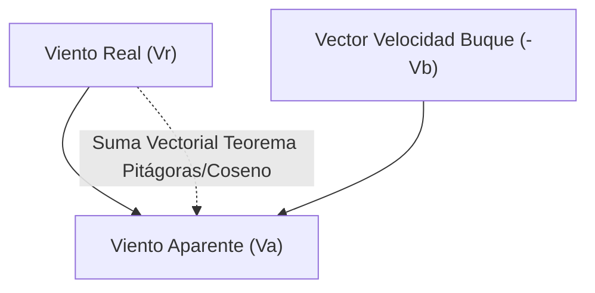
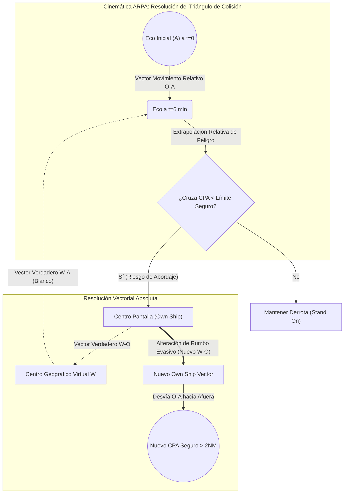

# Patrón de Yate - Tema 3: Teoría Analítica de Navegación (Cinemática, Radar y Mareas de Alta Precisión)

El dominio de la navegación en yates requiere operar analíticamente en un entorno dinámico de fluidos (mareas y viento) y anticipar las posiciones futuras de buques en el radar. La exactitud matemática y la resolución de triángulos vectoriales son críticas para la prevención de abordajes y encallamientos.

---

## 1. Mareas: Teoría Armónica y Sondas Matemáticas

Las mareas astronómicas son variaciones barotrópicas del océano inducidas por las fuerzas de marea gravitacional de la Luna y el Sol, descritas por la Teoría del Equilibrio de Newton y refinadas por el análisis armónico de Laplace.

### 1.1 El Entorno de Referencia Vertical (Datums)
El estudio topológico y batimétrico se realiza sobre ejes verticales invariables de la carta:
*   **Cero Hidrográfico ($ZH$):** Nivel mínimo histórico (Bajamar Escorada o LAT - Lowest Astronomical Tide) que evita sondas negativas. Es el *Datum* batimétrico.
*   **Sonda de la Carta ($S_c$):** Profundidad inamovible inscrita en el papel referida al Cero Hidrográfico.
*   **Altura de Marea ($Alt$):** Elevación temporal de la lámina de agua respecto al Cero. Función puramente armónica del tiempo ($t$).
*   **Sonda en el Momento ($S_m$):** El tirante de agua real y absoluto en el instante de paso:
    

$$
S_m(t) = S_c + Alt(t)
$$

*   **Resguardo bajo la Quilla ($UKC$ - Under Keel Clearance):** El margen de seguridad obligatorio para no embarrancar, restando el Calado del buque ($c$) a la Sonda Real:
    

$$
UKC = S_m(t) - c
$$

### 1.2 Cálculo Analítico Interpolar (El Método Trigonométrico Universal)

Para los exámenes de navegación se emplea un modelo oscilatorio simple asumiendo la curva de marea como una sinusoide perfecta.

Partiendo del Anuario de Mareas para extraer las características de los extremos (Pleamar $PM$ y Bajamar $BM$):
1.  **Amplitud de la Marea ($A$):** La excursión total de la ola de marea.
    

$$
A = Alt_{PM} - Alt_{BM}
$$

2.  **Duración de la Marea ($D$):** Intervalo de tiempo transcurrido entre el ciclo $BM \rightarrow PM$ (aprox. $375 \text{ min}$, ciclo semidiurno).
3.  **Intervalo de Tiempo ($I$):** El tiempo transcurrido desde el extremo de referencia elegido (generalmente la BM o PM más cercana) hasta el instante de interés.

La corrección aditiva sobre la altura de referencia se calcula asumiendo una velocidad angular constante de la marea de $180^\circ$ por cada período $D$. Por tanto, el ángulo de fase $\phi$ es:

$$
\phi = 90^\circ \cdot \frac{I}{D}
$$

La corrección en amplitud ($C$) es:

$$
C = A \cdot \sin^2\left(\frac{90^\circ \cdot I}{D}\right)
$$

*(Nota: Equivalente matemáticamente a $C = \frac{A}{2} \left[1 - \cos\left(180^\circ \cdot \frac{I}{D}\right)\right]$)*

**Cálculo Final:**
*   Si el cálculo inicia en Bajamar: $Alt_{\text{momento}} = Alt_{BM} + C$
*   Si el cálculo inicia en Pleamar: $Alt_{\text{momento}} = Alt_{PM} - C$

### 1.3 Influencia Atmosférica y Meteorológica (Efecto Barométrico Invertido)
Las previsiones del Anuario suponen una atmósfera isobárica estándar (ISA = $1013 \text{ hPa}$ o $760 \text{ mmHg}$). El agua obedece la hidrostática reaccionando al gradiente de presión como un fluido en vasos comunicantes globales.

$$
\Delta Alt (cm) = (1013 - P_{\text{real}}) \cdot \text{Factor de Respuesta}
$$

Asumiendo un factor casi isostático, $1 \text{ mb}$ induce una variación inversa de $1 \text{ cm}$.
*   $P = 980 \text{ mb}$ (Borrasca profunda) $\Rightarrow +33 \text{ cm}$ de agua de marea metereológica ("Surge" o marea de tempestad).
*   $P = 1030 \text{ mb}$ (Potente anticiclón) $\Rightarrow -17 \text{ cm}$. ¡Peligro crudo de varada sorpresiva!

### 1.4 Método Alternativo Simplificado: la Regla de los Doceavos

El método trigonométrico del apartado 1.2 es el más preciso, pero en el examen (y en la práctica a bordo sin calculadora científica a mano) es habitual resolver el mismo problema mediante la **Regla de los Doceavos**, que aproxima la sinusoide de marea dividiendo la Duración ($D$) en 6 intervalos iguales y repartiendo la Amplitud ($A$) en fracciones de doceavos según la secuencia $1$-$2$-$3$-$3$-$2$-$1$:

$$
\frac{D}{6} \Rightarrow +\frac{A}{12},\ +\frac{2A}{12},\ +\frac{3A}{12},\ +\frac{3A}{12},\ +\frac{2A}{12},\ +\frac{A}{12}
$$

Es decir, en la primera y sexta hora sube (o baja) solo $1/12$ de la amplitud total, en la segunda y quinta $2/12$, y en la tercera y cuarta (el tramo central, de máxima pendiente de la curva) $3/12$ cada una. Al sumar los seis tramos se recupera la amplitud completa ($1+2+3+3+2+1 = 12$ doceavos).

> [!NOTE]
> Este resumen es autocontenido para el examen. Para la deducción completa y un ejemplo numérico resuelto paso a paso con el Anuario de Mareas del I.H.M., consulta **[USO_DEL_ANUARIO.md, apartado "El Cálculo Práctico"](../../cartas_nauticas/USO_DEL_ANUARIO.md#el-cálculo-práctico-sonda-en-el-momento-t)**.

---

## 2. Cinemática Vectorial del Viento (Real, Buque y Aparente)

El estudio del empuje a vela y dispersión de gases depende exclusivamente de los diagramas de velocidad y transformaciones del sistema de referencia de inercial a móvil.

*   **Viento Real ($\vec{V}_r$):** El vector viento en el sistema de referencia inercial de la Tierra. Módulo y marcación.
*   **Viento Relativo o de Marcha del Buque ($\vec{V}_b$):** Viento provocado por el avance. Su vector tiene magnitud igual a la velocidad de buque en nudos, en dirección diametral opuesta al Rumbo.
*   **Viento Aparente ($\vec{V}_a$):** Suma vectorial galileana percibida en cubierta (leído por el anemómetro/veleta):
    

$$
\vec{V}_a = \vec{V}_r + \vec{V}_b
$$

### 2.1 Ecuaciones Trigonométricas del Triángulo de Vientos
Si aplicamos el Teorema del Coseno al triángulo vectorial:

$$
|\vec{V}_a| = \sqrt{ |\vec{V}_r|^2 + |\vec{V}_b|^2 + 2 \cdot |\vec{V}_r| \cdot |\vec{V}_b| \cdot \cos(\alpha) }
$$

Donde $\alpha$ es el ángulo desde la proa por el cual nos llega el Viento Real.

**Consecuencias Cinématicas Inmediatas:**
1.  **Aceleración Pura:** Si $|\vec{V}_b|$ aumenta (damos motor), la magnitud $|\vec{V}_a|$ crece, y la dirección resultante pivota vectorialmente hacia el eje longitudinal de la proa. (El viento "roza la proa").
2.  **Viento de Popa y Turbulencia Cero:** Si corremos un temporal a un largo o popa cerrada, donde $\alpha \approx 180^\circ$, y $|\vec{V}_b| \approx |\vec{V}_r|$, entonces $|\vec{V}_a| \rightarrow 0$. En cubierta habrá calma chicha, pero el riesgo de una trabuchada o pérdida de control sobre las olas (surf) es máximo.

### 2.2 Ejemplo Numérico Resuelto: Cálculo del Viento Aparente

**Enunciado:** Un yate navega a Rumbo Verdadero $R_v = 000^\circ$ (Norte puro) a una velocidad $V_b = 8\text{ kn}$. El anemómetro y las estaciones meteorológicas costeras confirman un Viento Real $V_r = 18\text{ kn}$ soplando desde el $270^\circ$ (viento de a Oeste, entrando por el través de babor, $\alpha = 90^\circ$ respecto a la proa). Calcule la Intensidad y la Dirección del Viento Aparente que leerá la veleta en cubierta.

*Resolución (método vectorial cartesiano, $x=$Este, $y=$Norte):*
1.  **Vector Viento Real** (procede del $270^\circ$, por tanto *sopla hacia* el $090^\circ$):
    

$$
V_{rx} = 18 \cdot \sin(090^\circ) = 18.0\text{ kn (E)} \qquad V_{ry} = 18 \cdot \cos(090^\circ) = 0\text{ kn}
$$

2.  **Vector Viento de Marcha** (igual y opuesto al rumbo del buque, $000^\circ + 180^\circ = 180^\circ$):
    

$$
V_{bx} = 8 \cdot \sin(180^\circ) = 0\text{ kn} \qquad V_{by} = 8 \cdot \cos(180^\circ) = -8.0\text{ kn (S)}
$$

3.  **Suma vectorial (Viento Aparente):**
    

$$
V_{ax} = 18.0 + 0 = 18.0\text{ kn} \qquad V_{ay} = 0 + (-8.0) = -8.0\text{ kn}
$$

4.  **Módulo e Intensidad:**
    

$$
|\vec{V}_a| = \sqrt{18.0^2 + (-8.0)^2} = \sqrt{324 + 64} = \sqrt{388} \approx 19.7\text{ kn}
$$

5.  **Dirección (de dónde sopla):** el vector resultante *hacia* donde sopla el aire tiene ángulo $\arctan(18.0 / -8.0)$ en el cuadrante SE, es decir, sopla hacia el $114^\circ$ aprox., luego **procede del $294^\circ$** aproximadamente — el viento aparente ha "avanzado" hacia la proa respecto al viento real ($270^\circ \rightarrow 294^\circ$), tal como predice la Consecuencia Cinemática 1 del apartado 2.1.

*Verifica este resultado y experimenta con otros ángulos de forma interactiva en la simulación* **[`simulaciones/02_viento_aparente.ipynb`](../../simulaciones/02_viento_aparente.ipynb)**.

---

## 3. Punteo Cinemático de Radar (Plotting ARPA)

Los radares náuticos proporcionan distancias de eco por Time-Of-Flight (TOF) del pulso magnetrón (Banda X). La evaluación del peligro no se infiere del movimiento del otro barco, sino de su **Movimiento Relativo** respecto al centro de nuestra pantalla PPI (Plan Position Indicator).

### 3.1 Fundamentos de Colisión (Triángulo de Velocidades)
Si la demoras sucesivas a un blanco permanecen constantes a lo largo del tiempo, y la distancia disminuye (el eco viaja en línea recta geométrica hacia el centro del display), existe un riesgo inminente e irremediable de abordaje a menos que se apliquen acciones evasivas drásticas.

### 3.2 Parámetros Analíticos del Sistema ARPA (Automatic Radar Plotting Aid)
El ordenador interno del radar resuelve continuamente ecuaciones de extrapolación cinemática, ofreciendo dos vectores críticos:
*   **CPA (Closest Point of Approach):** Distancia mínima transversal calculada a la que el blanco cruzará el centro del display (nuestro navío). Es la altura del triángulo rectángulo formado por el vector de movimiento relativo. Si $CPA < 1.0 \text{ NM}$ en altamar, el sistema activa alertas visuales/acústicas.
*   **TCPA (Time to CPA):** Tiempo restante para alcanzar el punto CPA.
    

$$
TCPA = \frac{\text{Distancia al CPA}}{\text{Velocidad Relativa del Eco}}
$$

**Mini-ejemplo directo de CPA/TCPA:** si un eco se sitúa a $D_0 = 8\text{ NM}$ de distancia con demora constante y se acerca con una Velocidad Relativa $V_{rel} = 16\text{ kn}$ (obtenida por dos marcaciones sucesivas como en el Problema 2 más abajo), entonces:

$$
TCPA = \frac{8\text{ NM}}{16\text{ kn}} = 0.5\text{ h} = 30\text{ minutos}
$$

Y como la demora permanece constante, $CPA = 0\text{ NM}$: colisión matemática segura si ninguno de los dos buques maniobra. Practica la construcción completa del triángulo W-O-A de forma interactiva en **[`simulaciones/07_cinematica_radar.ipynb`](../../simulaciones/07_cinematica_radar.ipynb)**.

### 3.3 El Triángulo de Movimiento (W-O-A / W-A-O) y Cinemática Diferencial
La cinemática del punteo (plotting manual) o la lógica de los microprocesadores ARPA conforman el epicentro del control y evitación de colisiones. Su base yace en la resolución trigonométrica de un espacio vectorial plano.
*   **Vector $W-O$ (Way of Own / Nuestro rumbo y velocidad verdadera):** Representa al buque observador en el sistema de referencia terrestre.
*   **Vector $W-A$ (Way of Another / Rumbo y velocidad verdadera del blanco):** El movimiento absoluto del otro buque con respecto a las coordenadas geográficas inerciales.
*   **Vector $O-A$ (Movimiento Relativo):** La trayectoria geométrica y velocidad del eco que barre la pantalla PPI respecto al centro de nuestra rosa de los vientos (nosotros fijos en el centro de origen $O$).
    

$$
\vec{V}_{OA} = \vec{V}_{WA} - \vec{V}_{WO}
$$

    En notación cinemática naval tradicional, esto a menudo se traza como el triángulo "e-r-m", donde la base es la cinemática euclidiana del eco.

Para evitar un abordaje (resolución del problema inverso de colisión), el marino u oficial de derrota debe manipular y transformar temporalmente su propio vector $\vec{V}_{WO}$ (sea alterando la RPM de máquina o metiendo grados de timón). Este acto modifica instantáneamente la dirección y módulo de $\vec{V}_{OA}$ (la nueva línea relativa del eco), forzando que su proyección futura intersecte la perpendicular transversal a una distancia (Nuevo CPA) mayor que el Anillo de Guarda pre-establecido en el protocolo de la naviera (e.g. 2 Millas Náuticas).

## Ejemplos Prácticos

**Problema 1: Cálculo Universal de Marea Trigonométrica**
Se desea franquear una barra cuyo fondo es $S_c = 1.20\text{ m}$. Nuestro calado es de $c = 2.10\text{ m}$. Exigimos un Resguardo Bajo la Quilla ($UKC$) mínimo de $0.50\text{ m}$. Las previsiones del Anuario de Mareas para el puerto son:
*   Bajamar: $06:20 \text{ UTC}$, Altura $= 0.60\text{ m}$
*   Pleamar: $12:45 \text{ UTC}$, Altura $= 3.40\text{ m}$
Calcule analíticamente la hora más temprana para cruzar sin tocar fondo en marea entrante.

*Resolución:*
1.  **Sonda necesaria ($S_m$):**
    

$$
S_m = c + UKC = 2.10\text{ m} + 0.50\text{ m} = 2.60\text{ m}
$$

2.  **Altura de marea mínima requerida ($Alt_{\text{req}}$):**
    

$$
Alt_{\text{req}} = S_m - S_c = 2.60\text{ m} - 1.20\text{ m} = 1.40\text{ m}
$$

3.  **Parámetros armónicos:**
    

$$
A (\text{Amplitud}) = 3.40 - 0.60 = 2.80\text{ m}
$$

    

$$
D (\text{Duración}) = 12:45 - 06:20 = 6\text{ h } 25\text{ m} = 385\text{ minutos}
$$

    

$$
C (\text{Corrección sobre la BM}) = Alt_{\text{req}} - Alt_{BM} = 1.40 - 0.60 = 0.80\text{ m}
$$

4.  **Inversión Trigonométrica de la Corrección para despejar el Intervalo ($I$):**
    Sabemos que $C = A \cdot \sin^2\left(\frac{90^\circ \cdot I}{D}\right)$
    

$$
0.80 = 2.80 \cdot \sin^2\left(\frac{90^\circ \cdot I}{385}\right)
$$

    

$$
\sin^2\left(\frac{90^\circ \cdot I}{385}\right) = \frac{0.80}{2.80} \approx 0.2857
$$

    

$$
\sin\left(\frac{90^\circ \cdot I}{385}\right) = \sqrt{0.2857} \approx 0.5345
$$

    

$$
\frac{90^\circ \cdot I}{385} = \arcsin(0.5345) \approx 32.31^\circ
$$

    

$$
I = \frac{32.31^\circ \cdot 385}{90^\circ} \approx 138.21\text{ minutos} = 2\text{ h } 18\text{ min}
$$

5.  **Hora Límite de Paso:**
    

$$
H_{\text{paso}} = H_{BM} + I = 06:20 + 02:18 = 08:38 \text{ UTC}
$$

    *(A las 08:38 UTC garantizamos un paso hidrodinámico con sonda suficiente).*

**Problema 2: Cálculo Cinemático Analítico ARPA - Abordaje con Blancos Múltiples**
Su radar, operando a rumbo Norte verdadero ($R_v = 000^\circ$) con velocidad propia $V_o = 15\text{ kn}$, capta un blanco B que se sitúa a demora verdadera $060^\circ$ a $10\text{ NM}$. Al cabo de 12 minutos, el blanco se encuentra en demora $060^\circ$ a $6\text{ NM}$.
Calcule algebraicamente el vector cinemático real (Rumbo Verdadero y Velocidad) del buque B, y analice por qué la inmutabilidad de la demora conforma el teorema de colisión de navegación euclidiana.

*Resolución:*
1.  **Deducción de la Situación y CPA:**
    La demora verdadera no cambia a lo largo del tiempo ($060^\circ$). Esto significa algebraicamente que el Movimiento Relativo está contenido colinealmente sobre la demora, trazando una recta geométrica directa al origen (nuestro barco).
    Por el Axioma de Cinemática, $\text{Demora Constante} + \text{Distancia Decreciente} \Rightarrow CPA = 0\text{ NM}$. (Colisión matemática inminente).
2.  **Cálculo de la Velocidad Relativa del Blanco ($V_{rel}$):**
    En $\Delta t = 12\text{ minutos}$ ($12/60 = 0.2\text{ horas}$), el blanco ha acortado la distancia en $\Delta d = 10 - 6 = 4\text{ NM}$.
    

$$
V_{rel} = \frac{\Delta d}{\Delta t} = \frac{4\text{ NM}}{0.2\text{ h}} = 20\text{ nudos}
$$

    La dirección del Movimiento Relativo (Rumbo Relativo) es recíproca a la demora, puesto que viene "hacia nosotros" desde el $060^\circ$. Luego $R_{rel} = 240^\circ$.
3.  **Resolución de los Vectores Verdaderos (Análisis Complejo X-Y):**
    Nuestra nave vector $\vec{V}_o$ (Norte a 15 kn): $Vx_o = 0, Vy_o = 15$
    Vector Relativo $\vec{V}_{rel}$ (20 kn hacia el 240º):
    

$$
Vx_{rel} = 20 \cdot \sin(240^\circ) = 20 \cdot (-0.866) = -17.32\text{ kn}
$$

    

$$
Vy_{rel} = 20 \cdot \cos(240^\circ) = 20 \cdot (-0.5) = -10.0\text{ kn}
$$

    La suma vectorial de la velocidad absoluta del blanco es $\vec{V}_b = \vec{V}_o + \vec{V}_{rel}$:
    

$$
Vx_b = 0 + (-17.32) = -17.32\text{ kn}
$$

    

$$
Vy_b = 15 + (-10.0) = 5.0\text{ kn}
$$

4.  **Cálculo del Rumbo y Velocidad Verdadera del Blanco B:**
    

$$
|\vec{V}_b| = \sqrt{(-17.32)^2 + (5.0)^2} = \sqrt{300 + 25} = \sqrt{325} \approx 18.03\text{ nudos}
$$

    El ángulo trigonométrico es $\arctan(-17.32 / 5.0) = \arctan(-3.464) \approx -73.9^\circ$ en el cuadrante Noroeste (X negativo, Y positivo).
    Por tanto, el Rumbo Verdadero del blanco es $360^\circ - 73.9^\circ = 286.1^\circ$.
    *Conclusión Operativa:* El blanco es un crucero muy veloz (18 nudos) cruzando de Este a Oeste al rumbo $286^\circ$. Nuestro buque cruza su línea a gran velocidad hacia el Norte, confluyendo geométricamente en el "Zero-CPA" colision point en exactamente 18 minutos más. Por el COLREG Regla 15, nosotros somos el buque que da paso (blanco por estribor), forzando a la maniobra evasiva obligatoria (meter timón a estribor o parada dramática de la hélice principal).

**Problema 3: Corrección por Nodos Astronómicos y Análisis de Interferencia de Ondas de Marea (Componentes Semidiurnos M2 y S2)**
El patrón hidrográfico debe modelar la marea equinoccial donde la onda lunar $M_2$ (amplitud $A_{M2} = 1.6\text{ m}$, periodo $12.42\text{ h}$) coincide con la onda solar $S_2$ (amplitud $A_{S2} = 0.7\text{ m}$, periodo $12.00\text{ h}$) en una sicigia colineal perfecta. Asumiendo que ambas alcanzan el cénit en t=0 (Fase 0), formule la función trigonométrica superpuesta del nivel de marea instantáneo $Z(t)$ respecto al Nivel Medio del Mar (NMM) y calcule el momento temporal del primer armónico destructivo (cuadratura instantánea dinámica o interferencia de baja modulación), también conocido como "Beat Period" (Período de Batido).

*Resolución:*
1.  **Planteamiento de Funciones Ondulatorias Espectrales:**
    La frecuencia angular en radianes/hora de cada componente es $\omega = \frac{2\pi}{T}$.
    

$$
\omega_{M2} = \frac{2\pi}{12.42} \approx 0.5059\text{ rad/h}
$$

    

$$
\omega_{S2} = \frac{2\pi}{12.00} \approx 0.5236\text{ rad/h}
$$

    La marea estática pura es $Z(t) = 1.6 \cdot \cos(0.5059 \cdot t) + 0.7 \cdot \cos(0.5236 \cdot t)$.
2.  **Marea Viva Inicial (Spring Tide, $t=0$):**
    $Z(0) = 1.6 + 0.7 = 2.3\text{ metros}$ sobre el Nivel Medio.
3.  **Cálculo Analítico del Período de Modulación (Batido Neap/Spring):**
    La envolvente macroscópica está definida por la diferencia de frecuencias y describe la alternancia de mareas Vivas a Muertas.
    

$$
T_{\text{batido}} = \frac{2\pi}{\omega_{S2} - \omega_{M2}} = \frac{2\pi}{0.5236 - 0.5059} = \frac{2\pi}{0.0177} \approx 355.0\text{ horas}
$$

    Esto equivale matemáticamente a $\approx 14.79\text{ días}$, coincidiendo perfectamente con la mitad del ciclo lunar sinódico (Luna Llena a Cuarto Menguante, o Nueva a Creciente).
4.  **Cuadratura Intersticial de Interferencia Destructiva Máxima (Neap Tide):**
    Ocurrirá en la mitad del ciclo de batido.
    

$$
t_{\text{cuadratura}} = \frac{355.0}{2} = 177.5\text{ horas}
$$

    En este instante $\approx 7.4\text{ días}$, las fases difieren en $180^\circ$ ($\pi$ radianes). Las ondas se cancelan mutuamente originando una Marea Muerta mínima con elevación en el paso inferior de:
    

$$
Z_{max}(\text{Neap}) = A_{M2} - A_{S2} = 1.6 - 0.7 = 0.9\text{ metros}
$$

    *El resultado refleja a nivel diferencial la física profunda detrás de las tablas simplificadas de la hidrografía naval.*

## Referencias Bibliográficas y Jurisprudencia

*   **Doctrina Académica:**
    *   *Admiralty Manual of Navigation, Vol 1 y 2* (Royal Navy). Fundamental en trigonometría esférica, plana y el comportamiento cinemático.
    *   *Radar and ARPA Manual* (A.G. Bole & A. Dineley). Elsevier. Aborda rigurosamente los vectores relativos W-O-A.
*   **Convenios IMO:**
    *   **COLREGs 1972 (Reglamento Internacional para Prevenir Abordajes):**
        *   Regla 7: Riesgo de Abordaje (Obligatoriedad del uso óptimo de equipos de radar y ARPA).
        *   Regla 8: Maniobras para Evitar Abordajes (Aplicación cinemática, las variaciones de rumbo deben ser amplias y no mediante pequeños escarceos).
*   **Jurisprudencia Almirantazgo:**
    *   *The "Andrea Doria" y "Stockholm" (1956):* Uno de los litigios y siniestros más paradigmáticos, causado directamente por la mala interpretación del vector de radar relativo (Radar Assisted Collision) y carencia de punteo ARPA automático, cruzando ambos sus proas estribor a estribor ciegas en la niebla.
    *   *The "Eurasia Dream" (2002) 1 Lloyd's Rep 719:* Discute los estándares requeridos de pericia y "Seamanship", donde la incapacidad del oficial para resolver la estima matemática fue categorizada como *Unseaworthiness* (Falta de navegabilidad) de la nave.
