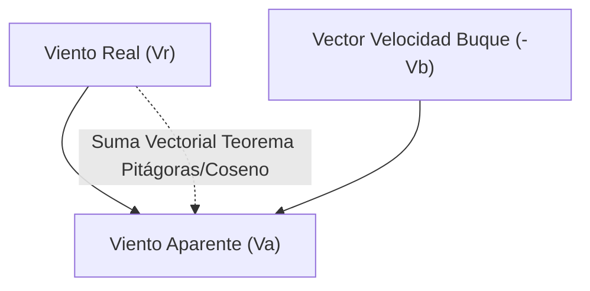

# Patrón de Yate - Tema 3: Teoría Analítica de Navegación (Cinemática, Radar y Mareas de Alta Precisión)

El dominio de la navegación en yates requiere operar analíticamente en un entorno dinámico de fluidos (mareas y viento) y anticipar las posiciones futuras de buques en el radar. La exactitud matemática y la resolución de triángulos vectoriales son críticas para la prevención de abordajes y encallamientos.

---

## 1. Mareas: Teoría Armónica y Sondas Matemáticas

Las mareas astronómicas son variaciones barotrópicas del océano inducidas por las fuerzas de marea gravitacional de la Luna y el Sol, descritas por la Teoría del Equilibrio de Newton y refinadas por el análisis armónico de Laplace.

### 1.1 El Entorno de Referencia Vertical (Datums)
El estudio topológico y batimétrico se realiza sobre ejes verticales invariables de la carta:
*   **Cero Hidrográfico ($ZH$):** Nivel mínimo histórico (Bajamar Escorada o LAT - Lowest Astronomical Tide) que evita sondas negativas. Es el *Datum* batimétrico.
*   **Sonda de la Carta ($S_c$):** Profundidad inamovible inscrita en el papel referida al Cero Hidrográfico.
*   **Altura de Marea ($Alt$):** Elevación temporal de la lámina de agua respecto al Cero. Función puramente armónica del tiempo ($t$).
*   **Sonda en el Momento ($S_m$):** El tirante de agua real y absoluto en el instante de paso:
    $$ S_m(t) = S_c + Alt(t) $$
*   **Resguardo bajo la Quilla ($UKC$ - Under Keel Clearance):** El margen de seguridad obligatorio para no embarrancar, restando el Calado del buque ($c$) a la Sonda Real:
    $$ UKC = S_m(t) - c $$

### 1.2 Cálculo Analítico Interpolar (El Método Trigonométrico Universal)

Para los exámenes de navegación se emplea un modelo oscilatorio simple asumiendo la curva de marea como una sinusoide perfecta.

Partiendo del Anuario de Mareas para extraer las características de los extremos (Pleamar $PM$ y Bajamar $BM$):
1.  **Amplitud de la Marea ($A$):** La excursión total de la ola de marea.
    $$ A = Alt_{PM} - Alt_{BM} $$
2.  **Duración de la Marea ($D$):** Intervalo de tiempo transcurrido entre el ciclo $BM \rightarrow PM$ (aprox. $375 \text{ min}$, ciclo semidiurno).
3.  **Intervalo de Tiempo ($I$):** El tiempo transcurrido desde el extremo de referencia elegido (generalmente la BM o PM más cercana) hasta el instante de interés.

La corrección aditiva sobre la altura de referencia se calcula asumiendo una velocidad angular constante de la marea de $180^\circ$ por cada período $D$. Por tanto, el ángulo de fase $\phi$ es:
$$ \phi = 90^\circ \cdot \frac{I}{D} $$

La corrección en amplitud ($C$) es:
$$ C = A \cdot \sin^2\left(\frac{90^\circ \cdot I}{D}\right) $$
*(Nota: Equivalente matemáticamente a $C = \frac{A}{2} \left[1 - \cos\left(180^\circ \cdot \frac{I}{D}\right)\right]$)*

**Cálculo Final:**
*   Si el cálculo inicia en Bajamar: $Alt_{\text{momento}} = Alt_{BM} + C$
*   Si el cálculo inicia en Pleamar: $Alt_{\text{momento}} = Alt_{PM} - C$

### 1.3 Influencia Atmosférica y Meteorológica (Efecto Barométrico Invertido)
Las previsiones del Anuario suponen una atmósfera isobárica estándar (ISA = $1013 \text{ hPa}$ o $760 \text{ mmHg}$). El agua obedece la hidrostática reaccionando al gradiente de presión como un fluido en vasos comunicantes globales.

$$ \Delta Alt (cm) = (1013 - P_{\text{real}}) \cdot \text{Factor de Respuesta} $$
Asumiendo un factor casi isostático, $1 \text{ mb}$ induce una variación inversa de $1 \text{ cm}$.
*   $P = 980 \text{ mb}$ (Borrasca profunda) $\Rightarrow +33 \text{ cm}$ de agua de marea metereológica ("Surge" o marea de tempestad).
*   $P = 1030 \text{ mb}$ (Potente anticiclón) $\Rightarrow -17 \text{ cm}$. ¡Peligro crudo de varada sorpresiva!

---

## 2. Cinemática Vectorial del Viento (Real, Buque y Aparente)

El estudio del empuje a vela y dispersión de gases depende exclusivamente de los diagramas de velocidad y transformaciones del sistema de referencia de inercial a móvil.

*   **Viento Real ($\vec{V}_r$):** El vector viento en el sistema de referencia inercial de la Tierra. Módulo y marcación.
*   **Viento Relativo o de Marcha del Buque ($\vec{V}_b$):** Viento provocado por el avance. Su vector tiene magnitud igual a la velocidad de buque en nudos, en dirección diametral opuesta al Rumbo.
*   **Viento Aparente ($\vec{V}_a$):** Suma vectorial galileana percibida en cubierta (leído por el anemómetro/veleta):
    $$ \vec{V}_a = \vec{V}_r + \vec{V}_b $$

### 2.1 Ecuaciones Trigonométricas del Triángulo de Vientos
Si aplicamos el Teorema del Coseno al triángulo vectorial:
$$ |\vec{V}_a| = \sqrt{ |\vec{V}_r|^2 + |\vec{V}_b|^2 + 2 \cdot |\vec{V}_r| \cdot |\vec{V}_b| \cdot \cos(\alpha) } $$
Donde $\alpha$ es el ángulo desde la proa por el cual nos llega el Viento Real.

**Consecuencias Cinématicas Inmediatas:**
1.  **Aceleración Pura:** Si $|\vec{V}_b|$ aumenta (damos motor), la magnitud $|\vec{V}_a|$ crece, y la dirección resultante pivota vectorialmente hacia el eje longitudinal de la proa. (El viento "roza la proa").
2.  **Viento de Popa y Turbulencia Cero:** Si corremos un temporal a un largo o popa cerrada, donde $\alpha \approx 180^\circ$, y $|\vec{V}_b| \approx |\vec{V}_r|$, entonces $|\vec{V}_a| \rightarrow 0$. En cubierta habrá calma chicha, pero el riesgo de una trabuchada o pérdida de control sobre las olas (surf) es máximo.

---

## 3. Punteo Cinemático de Radar (Plotting ARPA)

Los radares náuticos proporcionan distancias de eco por Time-Of-Flight (TOF) del pulso magnetrón (Banda X). La evaluación del peligro no se infiere del movimiento del otro barco, sino de su **Movimiento Relativo** respecto al centro de nuestra pantalla PPI (Plan Position Indicator).

### 3.1 Fundamentos de Colisión (Triángulo de Velocidades)
Si la demoras sucesivas a un blanco permanecen constantes a lo largo del tiempo, y la distancia disminuye (el eco viaja en línea recta geométrica hacia el centro del display), existe un riesgo inminente e irremediable de abordaje a menos que se apliquen acciones evasivas drásticas.

### 3.2 Parámetros Analíticos del Sistema ARPA (Automatic Radar Plotting Aid)
El ordenador interno del radar resuelve continuamente ecuaciones de extrapolación cinemática, ofreciendo dos vectores críticos:
*   **CPA (Closest Point of Approach):** Distancia mínima transversal calculada a la que el blanco cruzará el centro del display (nuestro navío). Es la altura del triángulo rectángulo formado por el vector de movimiento relativo. Si $CPA < 1.0 \text{ NM}$ en altamar, el sistema activa alertas visuales/acústicas.
*   **TCPA (Time to CPA):** Tiempo restante para alcanzar el punto CPA.
    $$ TCPA = \frac{\text{Distancia al CPA}}{\text{Velocidad Relativa del Eco}} $$

### 3.3 El Triángulo de Movimiento (W-O-A)
La cinemática del punteo (plotting manual) es el core del control marítimo:
*   **Vector e-r (nuestro rumbo/velocidad verdadera):** Representa al buque observador.
*   **Vector e-m (rumbo/velocidad verdadera del blanco):** El movimiento del otro buque respecto al mar.
*   **Vector r-m (movimiento relativo):** Lo que vemos físicamente en la pantalla.
    $$ \vec{v}_{\text{relativo}} = \vec{v}_{\text{blanco}} - \vec{v}_{\text{observador}} $$

Para evitar un abordaje, el marino debe resolver el triángulo inverso para determinar un nuevo vector de observador (nuevo rumbo/velocidad) que obligue al CPA resultante a salir fuera del radio de seguridad establecido (ej. desviar la línea relativa 2 millas a estribor).
