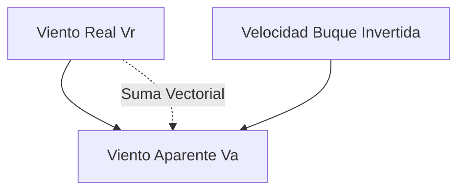

# Patrón de Yate - Tema 3: Teoría de Navegación (Mareas, Cinemática y Radar)

Este tema exige dominar el cálculo riguroso de mareas para no quedarse varado al entrar a puertos de régimen macareo (como Huelva o Cádiz), comprender la cinemática vectorial del viento para gobernar embarcaciones a vela, y dominar el punteo cinemático de radar para evitar abordajes.

---

## 1. Teoría y Cálculo de Mareas (Problemas de Sonda)

Las mareas son movimientos periódicos de ascenso y descenso del nivel del mar producidos por la atracción gravitatoria conjunta de la Luna y el Sol. En las zonas de examen de PY (Andalucía, Galicia, Cantábrico) son críticas.

### 1.1. Conceptos y Tipos de Sonda
*   **Cero Hidrográfico:** El nivel de referencia absoluto a partir del cual se miden las profundidades en las cartas náuticas. En España coincide con la **Bajamar Escorada** (la marea más baja matemáticamente posible).
*   **Sonda de la Carta ($Sc$):** La profundidad impresa en el papel de la carta. Está referida al Cero Hidrográfico.
*   **Altura de Marea ($Alt$):** El desnivel vertical del agua en un momento dado por encima del Cero Hidrográfico. Siempre es un valor positivo o cero.
*   **Sonda en el Momento ($Sm$):** La profundidad real física de la columna de agua bajo la superficie en un instante exacto.
    $$ Sm = Sc + Alt $$
*   **Calado ($c$):** Lo que se hunde el barco bajo el agua.
*   **Resguardo bajo la quilla (Clearance):** El colchón de seguridad de agua entre nuestra quilla y el fondo (el fango o roca).
    $$ Resguardo = Sm - Calado $$

### 1.2. Fórmulas de Cálculo Analítico de Mareas (Método Universal)
En el *Anuario de Mareas*, buscamos el puerto y la fecha. Obtenemos la hora y altura de la Pleamar (PM) y Bajamar (BM) más cercanas a nuestra llegada. El problema del PY suele ser: *Llego a las 14:15, ¿cuánta agua hay exactamente?*

1.  **Amplitud ($A$):** Diferencia de altura. $A = Alt_{PM} - Alt_{BM}$
2.  **Duración ($D$):** Tiempo transcurrido entre BM y PM (suele rondar 6h 15m). Se pasa a minutos para operar.
3.  **Intervalo ($I$):** Tiempo transcurrido desde la Pleamar o Bajamar (la que usemos de base) hasta nuestra hora de llegada. Se pasa a minutos.
4.  **Corrección Aditiva/Sustractiva ($C$):** Se calcula con la fórmula universal trigonométrica:
    $$ C = A \cdot \sin^2\left(\frac{90^\circ \cdot I}{D}\right) $$
5.  **Cálculo Final:** 
    *   Si calculamos usando la Bajamar como base: **$Alt_{momento} = Alt_{BM} + C$**
    *   Si calculamos usando la Pleamar como base: **$Alt_{momento} = Alt_{PM} - C$**

### 1.3. La Corrección por Presión Atmosférica
Las predicciones del Anuario asumen una presión atmosférica estándar de 1013 milibares. Si el barómetro marca diferente, el agua subirá o bajará físicamente. La regla fundamental es que **el mar funciona como un barómetro de mercurio invertido**.
*   **Regla:** Por cada milibar de variación respecto a 1013, el nivel del mar varía 1 centímetro en sentido inverso.
    *   Si hay Altas Presiones (Anticiclón, ej. 1023 mb): El peso del aire "aplasta" el mar. Hay 10 mb extra $\rightarrow$ el nivel real será **10 cm menos** de lo predicho.
    *   Si hay Bajas Presiones (Borrasca, ej. 993 mb): El mar "se infla". Hay 20 mb menos $\rightarrow$ el nivel real será **20 cm más** de lo predicho.

---

## 2. Viento Real y Viento Aparente (Cinemática Vectorial)

La navegación a vela, o el comportamiento de los olores o humos de un barco a motor, están dictados por el Viento Aparente. El viento atmosférico es modificado por la propia velocidad del barco.

*   **Viento Real ($Vr$):** El viento de la atmósfera (el que sentirías parado en la costa).
*   **Viento del Buque ($Vb$):** O "Viento Relativo". Al moverte a 10 nudos hacia el Norte, generas un flujo de viento en tu cara de 10 nudos viniendo exactamente del Norte, independientemente de lo que haga la atmósfera.
*   **Viento Aparente ($Va$):** Es la suma vectorial de $Vr + Vb$. Es el viento que sientes en la cara y que marcan las veletas y anemómetros a bordo de un barco en marcha.

### Leyes Físicas del Viento Aparente
1.  **Aceleración:** Cuando un barco acelera, el Viento Aparente **aumenta de intensidad y "cae" hacia la proa** (se aproa).
2.  **Deceleración:** Si frenas, el Viento Aparente **disminuye y "abre" hacia la popa** (se acerca a la dirección del viento real).
3.  **Límites:** Si tienes viento de popa real de 10 nudos y navegas a 10 nudos a motor, el Viento Aparente será 0 nudos. (Te asarás de calor en cubierta aunque el humo del puro subirá recto).

---

## 3. Cinemática de Radar (ARPA y Punteo)

La pantalla del radar presenta un **Movimiento Relativo**. Tú estás eternamente quieto en el centro exacto de la pantalla de fósforo. Todo el universo se mueve a tu alrededor.
Si un eco en la pantalla se mueve trazando una línea recta directa hacia tu centro (Demora constante), significa **rumbo de colisión inminente**.

### Parámetros Críticos (ARPA)
*   **CPA (Closest Point of Approach - Punto de Máxima Aproximación):** Es la distancia más pequeña a la que pasará el buque objetivo de nosotros si ninguno de los dos altera el rumbo o velocidad. Si CPA es 0, hay abordaje seguro. Si es 0.5 millas, pasará rozando.
*   **TCPA (Time to CPA):** Es una cuenta atrás matemática. Los minutos y segundos que faltan para alcanzar el punto CPA.
*   **Movimiento Verdadero:** En radares avanzados, puedes cambiar el modo a "Verdadero". Aquí la pantalla muestra un mapa estático; tú ves tu eco avanzando, el otro barco avanzando, y la tierra quieta.
*   **Zonas de Guardia:** Anillos virtuales de seguridad programables en el radar. Si un eco cruza la frontera del anillo preestablecido (ej. a 2 millas de nosotros), suena una alarma acústica para despertar al oficial de guardia.
