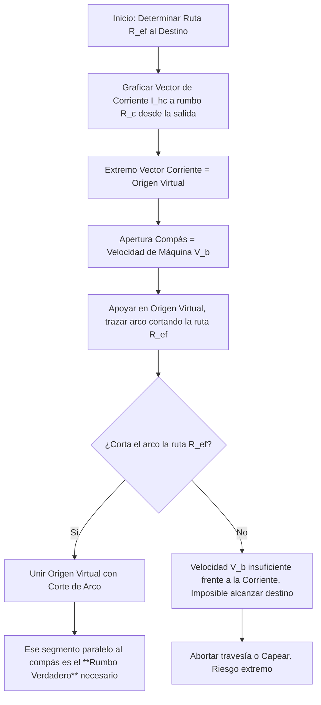

# Patrón de Yate - Tema 4: Navegación Avanzada (Loxodrómica, Análisis Vectorial de Corrientes y Trigonometría Costera)

El examen de Patrón de Yate en la carta del Estrecho de Gibraltar (105) es un ejercicio absoluto de destreza geométrica y álgebra vectorial. La precisión en el trazado se entrelaza con el uso intensivo de trigonometría plana (loxodrómica) para trayectos largos y cálculos de cinemática de derroteros bajo influencia fluida.

---

## 1. Fundamentos Matemáticos de la Navegación Loxodrómica (Estima Analítica)

La Navegación por Estima Analítica ("Dead Reckoning" algorítmica) permite deducir las coordenadas latitud/longitud de llegada a partir de un punto de salida, resolviendo las ecuaciones diferenciales del movimiento sobre un elipsoide simplificado como plano ecuatorial (Trigonometría Plana de Corta Distancia).

El Rumbo Loxodrómico es aquel que corta todos los meridianos terrestres con un ángulo de incidencia constante. Sobre la proyección Mercator de la carta, se representa como una línea recta perfecta, aunque físicamente corresponda a una espiral que envuelve el polo sobre la esfera terrestre.

### 1.1 Deducción del Triángulo de Estima
Si partimos de unas coordenadas iniciales de Salida ($l_s, L_s$), mantenemos un Rumbo Verdadero ($R_v$) y navegamos una Distancia de corredera ($D$) en millas náuticas, el viaje traza la hipotenusa de un triángulo rectángulo diferencial en la superficie.

1.  **Diferencia de Latitud ($\Delta l$):** Proyección polar (Norte/Sur).
    Integrando el diferencial geográfico $dl = dD \cdot \cos(R_v)$:
    

$$
\Delta l = D \cdot \cos(R_v)
$$

    *El resultado es en minutos de grado (millas náuticas). Algebráico (+ Norte, - Sur). Latitud de llegada = $l_s + \Delta l$.*

2.  **Apartamiento ($A$):** Longitud del arco paralelo (Este/Oeste) medido en millas físicas.
    

$$
A = D \cdot \sin(R_v)
$$

3.  **Latitud Media ($l_m$):** Como la Tierra es esférica, la separación física de los meridianos es máxima en el ecuador y colapsa a 0 en los polos. El apartamiento se ajusta tomando la secante de la latitud promedio de la travesía:
    

$$
l_m = \frac{l_s + l_{\text{llegada}}}{2}
$$

4.  **Diferencia de Longitud ($\Delta L$):** Proyección ecuatorial angular, requerida para calcular el meridiano final.
    

$$
\Delta L = \frac{A}{\cos(l_m)} = A \cdot \sec(l_m)
$$

    *(Resultado en minutos angulares. Algebráico: + Este, - Oeste. Longitud de llegada = $L_s + \Delta L$)*.

### 1.2 Problema Inverso (Determinación Analítica del Vector Directo)
Para efectuar operaciones de salvamento hacia unas coordenadas de rescate precisas ($l_{\text{llegada}}, L_{\text{llegada}}$):
1.  Hallar $\Delta l$ y $\Delta L$ por sustracción algebraica.
2.  Calcular $l_m$ y despejar Apartamiento: $A = \Delta L \cdot \cos(l_m)$
3.  Determinar el Rumbo Directo (Tangente):
    

$$
\tan(R_v) = \frac{A}{\Delta l}
$$

    *(Se obtiene un ángulo de cuadrante. Si $\Delta l < 0$ y $A > 0$, el rumbo es del 2º Cuadrante, es decir, el $R_v$ final será $180^\circ - \text{ángulo}_{\text{calculado}}$.)*
4.  Distancia al objetivo (Euclidiana):
    

$$
D = \frac{\Delta l}{\cos(R_v)}
$$

---

## 2. Abatimiento: Dinámica Aerodinámica Transversal

La acción de las partículas de viento sobre la obra muerta del buque genera una fuerza lateral que, conjugada con la resistencia hidrodinámica longitudinal, produce un ángulo de guiñada asimétrica: el **Abatimiento ($A_b$)**.

$$
R_s = R_v + A_b
$$

Donde $R_s$ es el **Rumbo de Superficie**, es decir, el vector estela real sobre el mar.

**Convenio de Signos Analítico:**
*   Viento recibiendo por la aleta o amura de **Babor**: Empuje lateral a Estribor. Abatimiento hacia la derecha. $\Rightarrow \mathbf{A_b > 0}$
*   Viento recibiendo por la aleta o amura de **Estribor**: Empuje lateral a Babor. Abatimiento hacia la izquierda. $\Rightarrow \mathbf{A_b < 0}$

*(El cálculo magistral del puente dicta que para trazar el Rumbo de Aguja en el compás magistral: $R_a = R_s - A_b - C_t$)*.

---

## 3. Cinemática Exacta del Vector Corriente

La corriente oceánica arrastra pasivamente todo el dominio hidro-espacial del barco, introduciendo una componente de traslación inercial galileana pura. Sus componentes son el Rumbo de la Corriente ($R_c$) y la Intensidad Horaria de Corriente ($I_{hc}$ en nudos).

### 3.1 Geometría del Problema Directo (¿Dónde caeremos?)
Si aplicamos nuestras máquinas para hacer un Rumbo de Superficie ($R_s$) a una Velocidad de Buque ($V_b$), y sufrimos un sistema de corriente ($R_c, I_{hc}$):

$$
\vec{V}_{\text{efectiva}} = \vec{V}_{\text{buque}} + \vec{V}_{\text{corriente}}
$$

> [!NOTE]
> El planteamiento vectorial del Rumbo y la Velocidad Efectiva es idéntico al que usa el PER en su forma básica y al que reutiliza el CY en aguas oceánicas. Un resumen conciso con el mismo ejemplo tipo examen (deriva por corriente y por abatimiento combinados) está en **[CALCULOS_DE_NAVEGACION.md, sección 1 "El Triángulo de Velocidades"](../../cartas_nauticas/CALCULOS_DE_NAVEGACION.md#1-el-triángulo-de-velocidades-deriva-y-corrientes)**.

En el plano vectorial cartesiano ($x=$ Este, $y=$ Norte):

$$
V_{x, \text{efectivo}} = V_b \cdot \sin(R_s) + I_{hc} \cdot \sin(R_c)
$$

$$
V_{y, \text{efectivo}} = V_b \cdot \cos(R_s) + I_{hc} \cdot \cos(R_c)
$$

$$
R_{\text{efectivo}} = \arctan\left(\frac{V_{x, \text{efectivo}}}{V_{y, \text{efectivo}}}\right)
$$

$$
V_{\text{efectiva}} = \sqrt{V_{x, \text{efectivo}}^2 + V_{y, \text{efectivo}}^2}
$$

El **Rumbo Efectivo ($R_{ef}$)** es la traza sobre el suelo del fondo oceánico; la **Velocidad Efectiva ($V_{ef}$)** es la celeridad absoluta respecto a un satélite.

### 3.2 Geometría del Problema Inverso (Solución Táctica de Intercepción)
Requerimos innegociablemente navegar sobre una trayectoria geométrica (Rumbo Efectivo deseado para llegar a puerto) bajo fuertes mareas del Estrecho. Debemos hallar el **Rumbo Verdadero (ángulo de cangrejo)** de la proa.

**Método Gráfico Ortodoxo en Carta (Ley de los Senos aplicados al Triángulo):**
1.  **Punto de Origen Real ($O_R$):** Trazar una línea recta semi-infinita que una nuestra posición actual con el faro de destino. Este es el carril innegociable sobre el fondo, o Derrota Proyectada (Rumbo Efectivo $R_{ef}$).
2.  **Traslación de Deriva de Marea:** Desde el Origen $O_R$, proyectamos matemáticamente el vector fluido puro de corriente marina $(R_c, I_{hc})$ empleando un escalar de distancia, por ejemplo la corriente sufrida en una hora cronometrada. El extremo terminal de este vector dibuja el "Origen Virtual de Arrastre" ($O_V$).
3.  **Radio Vector y Enganche:** Utilizando un compás de puntas secas de precisión geodésica, se calibra su apertura exactamente a la magnitud modular de nuestra capacidad propulsora hidrodinámica por hora ($V_b$). Haciendo centro de la punta metálica en el extremo del vector de marea $O_V$, se traza un arco de circunferencia ("Arco Capaz Cinemático").
4.  **Corte e Identidad Geométrica:** La intersección estricta del arco del compás con el rayo semi-infinito de nuestra ruta anhelada define el Vértice Cinemático final.
5.  **Alineación Magistral de la Proa:** La línea imaginaria que conecta ininterrumpidamente el Origen Virtual ($O_V$) con el punto de intersección recién tallado en la carta encarna exactamente el **Rumbo de Superficie ($R_s$) o Verdadero** (ángulo de cangrejo/crabbing angle). Aplicar los coeficientes magnéticos a este rumbo asegura nuestro destino sin salirse ni una eslora del $R_{ef}$ marcado en la carta.

---

## 4. Trigonometría de Situación Costera de Precisión

### 4.1 Triangulación por Demoras (Error de Somville)
Tres o más Demoras Verdaderas ($D_v$) intersecan idóneamente en un punto euclidiano simple. Sin embargo, debido al error sistemático y accidental (vibración, paralaje, aguja), conforman el **Triángulo de Error**. El lugar geométrico de máxima verosimilitud de la posición baricéntrica, según el axioma de Somville, reside en el incentro/ortocentro del polígono formado, si el error magnético es constante en los tres relevamientos.

### 4.2 Arco Capaz (Técnica Analítica de Ángulos Horizontales)
Es el método de posicionamiento más resiliente pues resulta matemáticamente indemne frente a errores magnéticos o de desvío del compás. Se efectúa operando un sextante naval en plano paralelo al horizonte, extrayendo el arco angular real ($\alpha$) entre dos faros colineales $A$ y $B$.

El locus geográfico resultante pertenece al **Arco Capaz** geométrico que subtende el segmento $\overline{AB}$.
Para hallar los centros de la circunferencia en la carta:
1.  Unimos ambos faros $A$ y $B$. Trazamos su mediatriz de forma analítica (ortogonal de punto medio).
2.  En el faro $A$ y en el $B$, levantamos sendos rayos a $90^\circ - \alpha$ de la línea base (si el ángulo del sextante $\alpha$ es $< 90^\circ$).
3.  La intersección del rayo con la mediatriz dicta las coordenadas precisas del Centro ($O$) de la circunferencia isométrica. Apoyando el compás, el trazo englobará A, B, y todas las posibles situaciones del yate en el mar.

## Ejemplos Prácticos

**Problema 1: Cálculo del Rumbo Efectivo Intersecado (Corriente Fuerte)**
Zarpamos del punto $A$ (situación inicial) a 12 nudos ($V_b = 12\text{ kn}$). Requerimos seguir a un puerto de refugio $B$ situado geométricamente al $045^\circ$ Verdaderos (este es nuestro Rumbo Efectivo proyectado $R_{ef} = 045^\circ$). Sabemos por el Derrotero que la marea y la corriente de deriva generan un vector combinado $R_c = 110^\circ$ con una $I_{hc} = 3.5\text{ kn}$. Calcule el Rumbo de Superficie ($R_s$) y la Velocidad Efectiva ($V_{ef}$) usando el Teorema del Seno sobre el triángulo cinemático.

*Resolución:*
1.  **Planteamiento del Triángulo Vectorial (C-O-B):**
    En el triángulo, los lados son las velocidades ($V_b, I_{hc}, V_{ef}$). Los ángulos opuestos son la clave.
    *   El ángulo entre el vector Corriente ($R_c = 110^\circ$) y el vector Rumbo Efectivo ($R_{ef} = 045^\circ$) es:
        

$$
\theta_{\text{interno}} = 110^\circ - 45^\circ = 65^\circ
$$

        Este es el ángulo opuesto al vector $V_b$ (12 kn).
    *   Llamaremos $\delta$ (ángulo de deriva de corrección) al ángulo formado entre el $R_{ef}$ y el $R_s$. Este es el ángulo opuesto al vector Corriente ($I_{hc} = 3.5\text{ kn}$).
2.  **Aplicación de la Ley de los Senos:**
    

$$
\frac{I_{hc}}{\sin(\delta)} = \frac{V_b}{\sin(\theta_{\text{interno}})}
$$

    

$$
\frac{3.5}{\sin(\delta)} = \frac{12}{\sin(65^\circ)}
$$

    

$$
\sin(\delta) = \frac{3.5 \cdot \sin(65^\circ)}{12} \approx \frac{3.5 \cdot 0.9063}{12} \approx \frac{3.172}{12} \approx 0.2643
$$

    

$$
\delta = \arcsin(0.2643) \approx 15.3^\circ
$$

3.  **Deducción del Rumbo de Superficie ($R_s$):**
    La corriente nos empuja hacia la derecha (del $045^\circ$ hacia el $110^\circ$). Por tanto, debemos "apuntar" la proa hacia la izquierda del $R_{ef}$ para compensar el arrastre galileano.
    

$$
R_s = R_{ef} - \delta = 045^\circ - 15.3^\circ = 029.7^\circ \text{ (Aprox. } 030^\circ\text{)}
$$

4.  **Cálculo de la Velocidad Efectiva ($V_{ef}$) - Ley de Cosenos o Ángulo Faltante:**
    El ángulo restante del triángulo es:
    

$$
\gamma = 180^\circ - 65^\circ - 15.3^\circ = 99.7^\circ
$$

    Esta $\gamma$ es el ángulo opuesto a $V_{ef}$. Usando la ley del Seno nuevamente:
    

$$
\frac{V_{ef}}{\sin(99.7^\circ)} = \frac{12}{\sin(65^\circ)}
$$

    

$$
V_{ef} = \frac{12 \cdot 0.9857}{0.9063} \approx \frac{11.828}{0.9063} \approx 13.05\text{ nudos}
$$

**Problema 2: Estimación Analítica Loxodrómica Inversa y Resolución Diferencial Magnética en una Travesía Transmeridiana**
Su yate zarpa desde el Faro de Trafalgar (Lat $= 36^\circ 10.9' \text{ N}$, Lon $= 006^\circ 01.5' \text{ W}$) bajo una fuerte precipitación borrascosa. Debe entregar un paquete de emergencia a un dique flotante ubicado precisamente en las coordenadas oceánicas (Lat $= 35^\circ 30.5' \text{ N}$, Lon $= 008^\circ 15.8' \text{ W}$). La Declinación Magnética inscrita en la carta náutica (Época 2018) señala $2^\circ 30' \text{ W}$ con una variación anual hiperbólica de $+7' \text{ E}$. El Desvío del compás tabulado de su puente acusa $\Delta = -4^\circ \text{ (Babor)}$. Considerando el año actual de travesía como 2026, calcule mediante trigonometría Loxodrómica Plana el **Rumbo de Aguja Estricto ($R_a$)** y el número de horas al timón, si su máquina principal empuja a un estricto régimen logístico de $8.5\text{ kn}$.

*Resolución:*
1.  **Cálculo de Proyecciones Geográficas ($\Delta l, \Delta L$ y Latitud Media $l_m$):**
    

$$
l_{\text{salida}} = 36^\circ 10.9' \text{ N} = 36.1817^\circ
$$

    

$$
l_{\text{llegada}} = 35^\circ 30.5' \text{ N} = 35.5083^\circ
$$

    Diferencia Latitud ($\Delta l$): $35.5083 - 36.1817 = -0.6734^\circ = 40.40' \text{ hacia el Sur (S)}$.
    

$$
L_{\text{salida}} = 006^\circ 01.5' \text{ W} = -6.0250^\circ
$$

    

$$
L_{\text{llegada}} = 008^\circ 15.8' \text{ W} = -8.2633^\circ
$$

    Diferencia Longitud ($\Delta L$): $-8.2633 - (-6.0250) = -2.2383^\circ = 134.3' \text{ hacia el Oeste (W)}$.
    

$$
l_m = \frac{36.1817 + 35.5083}{2} = 35.845^\circ
$$

2.  **Cálculo del Apartamiento Ecuatorial ($A$):**
    

$$
A = \Delta L \cdot \cos(l_m) = 134.3' \cdot \cos(35.845^\circ) = 134.3 \cdot 0.8106 = 108.86\text{ millas} \text{ (W)}
$$

3.  **Deducción Tangencial del Rumbo Directo Verdadero ($R_v$):**
    

$$
\tan(R_v) = \frac{A}{\Delta l} = \frac{108.86}{40.40} \approx 2.6946
$$

    

$$
\text{Ángulo Loxodrómico} = \arctan(2.6946) \approx 69.6^\circ
$$

    Al ser hacia el Sur y el Oeste, estamos geométricamente en el tercer cuadrante (Sudoeste).
    

$$
R_v (\text{Cuadrantal}) = \text{S } 69.6^\circ \text{ W}
$$

    

$$
R_v (\text{Circular}) = 180^\circ + 69.6^\circ = 249.6^\circ \text{ Verdaderos}
$$

4.  **Cálculo de la Distancia Directa (D) Euclidiana y ETA Operacional:**
    

$$
D = \frac{\Delta l}{\cos(69.6^\circ)} = \frac{40.40}{0.3486} \approx 115.9\text{ millas náuticas}
$$

    

$$
\text{Tiempo en Marcha} = \frac{115.9}{8.5\text{ kn}} \approx 13.63\text{ horas (13 h y 38 min)}
$$

5.  **Corrección Magnética y Variación Secular hacia la Aguja:**
    *Años transcurridos:* $2026 - 2018 = 8\text{ años}$.
    *Variación total:* $8\text{ años} \cdot (+7' \text{ E}) = +56' \text{ E}$.
    *Declinación Magnética en 2026 ($dm$):* $2^\circ 30' \text{ W} = -2^\circ 30'$.
    $-2^\circ 30' + 0^\circ 56' = -1^\circ 34' = -1.57^\circ \text{ (Oeste)}$.
    *Corrección Total ($C_t$):* $C_t = dm + \Delta = (-1.57^\circ) + (-4^\circ) = -5.57^\circ$.
    

$$
R_a = R_v - C_t = 249.6^\circ - (-5.57^\circ) = 255.17^\circ \text{ (Aprox. } 255^\circ \text{ en bitácora)}
$$

**Problema 3: Compensación Compleja Aerohidrodinámica (Abatimiento Sumado a Deriva) e Inversión Vectorial**
Su posición satelital (Fix GPS) lo ubica a $4.5\text{ NM}$ al sur verdadero de Punta Europa. Usted tiene programado el timón en un Rumbo de Aguja $R_a = 095^\circ$, con su máquina dando una velocidad en corredera hidrodinámica $V_b = 9\text{ kn}$. Las condiciones ambientales en el estrecho son extremas: el temporal de levante (Viento del Este franco de amura) ejerce una brutal presión aerodinámica lateral generando un Abatimiento medido y comprobado de $A_b = -12^\circ$ (a Babor). Paralelamente, una intrusión de agua fría del fondo interpone una fuerte Corriente $R_c = 135^\circ$ y una fuerza torrencial de $I_{hc} = 4\text{ kn}$. (Considere para todo el ejercicio una $C_t = -3^\circ$).
Determine, resolviendo escalonadamente los vectores del mar superficial y del manto oceánico de fondo, cuál será su posición teórica exacta mediante estima combinada al cabo de 2 horas continuas de navegación tortuosa bajo estos forzamientos cruzados (Coordenadas geográficas iniciales referenciales Punta Europa: Lat $= 36^\circ 06.5' \text{ N}$, Lon $= 005^\circ 20.8' \text{ W}$).

*Resolución:*
1.  **Deducción del Rumbo Real de Superficie con Abatimiento Aerodinámico ($R_s$):**
    

$$
R_v = R_a + C_t = 095^\circ + (-3^\circ) = 092^\circ
$$

    Este es el rumbo de la línea de crujía. El viento viene de proa-estribor empujando el casco y su vela seca transversalmente hacia babor.
    

$$
R_s = R_v + A_b = 092^\circ + (-12^\circ) = 080^\circ
$$

    *Su rastro en el agua superficial va dirigido al 080º, avanzando 9 millas cada hora sobre ese riel líquido.*
2.  **Descomposición Vectorial Cartesiana ($X=$ Este, $Y=$ Norte) del Movimiento Combinado:**
    La nave como masa experimenta una adición lineal galileana en el fondo oceánico inamovible (Rumbo Efectivo $R_{ef}$ y Velocidad Efectiva $V_{ef}$).
    Vector Buque-Superficie (Rumbo $080^\circ$, Vel $9\text{ kn}$):
    

$$
V_{bx} = 9 \cdot \sin(080^\circ) = 9 \cdot 0.9848 = 8.86\text{ kn (E)}
$$

    

$$
V_{by} = 9 \cdot \cos(080^\circ) = 9 \cdot 0.1736 = 1.56\text{ kn (N)}
$$

    Vector Corriente (Rumbo $135^\circ$, Vel $4\text{ kn}$):
    

$$
C_x = 4 \cdot \sin(135^\circ) = 4 \cdot 0.7071 = 2.83\text{ kn (E)}
$$

    

$$
C_y = 4 \cdot \cos(135^\circ) = 4 \cdot (-0.7071) = -2.83\text{ kn (S)}
$$

    Suma de Vectores Efectivos Absolutos (Fondo oceánico por hora):
    

$$
V_{ef(X)} = 8.86 + 2.83 = 11.69\text{ kn (Total Este por hora)}
$$

    

$$
V_{ef(Y)} = 1.56 + (-2.83) = -1.27\text{ kn (Total Sur por hora)}
$$

3.  **Proyección Loxodrómica Directa Tras 2 Horas de Navegación ($\Delta t = 2$):**
    Apartamiento y Diferencia de Latitud producidos en total:
    

$$
\Delta l \text{ (Total en millas)} = V_{ef(Y)} \cdot 2 = -1.27 \cdot 2 = -2.54' \text{ (Sur)}
$$

    

$$
A \text{ (Total en millas)} = V_{ef(X)} \cdot 2 = 11.69 \cdot 2 = 23.38\text{ millas}
$$

4.  **Cálculo de Coordenadas Finales Absolutas de la Estima Compleja:**
    *Coordenada de Inicio en el Mar (4.5 NM al Sur de Pta Europa):*
    $l_{\text{salida}} = 36^\circ 06.5' \text{ N} - 4.5' = 36^\circ 02.0' \text{ N} = 36.0333^\circ$
    $L_{\text{salida}} = 005^\circ 20.8' \text{ W} = -5.3467^\circ$
    *Nueva Latitud de Llegada:*
    

$$
l_{\text{llegada}} = l_{\text{salida}} + \Delta l = 36^\circ 02.0' - 0^\circ 02.54' = 35^\circ 59.46' \text{ N}
$$

    *Diferencia de Longitud con Latitud Media:*
    $l_m = (36^\circ 02.0' + 35^\circ 59.46') / 2 \approx 36^\circ 00.7'$ (Tomaremos $36^\circ$ para cálculos trigonométricos eficientes en alta mar).
    

$$
\Delta L = \frac{A}{\cos(36^\circ)} = \frac{23.38}{0.8090} \approx 28.90' \text{ (Este)} = +0^\circ 28.9'
$$

    *Nueva Longitud de Llegada:*
    

$$
L_{\text{llegada}} = 005^\circ 20.8' \text{ W} + 28.9' \text{ E} = (-5^\circ 20.8') + (+0^\circ 28.9') = 004^\circ 51.9' \text{ W}
$$

    **Respuesta Final de Rescate:** Latitud: $35^\circ 59.5' \text{ N}$ | Longitud: $004^\circ 51.9' \text{ W}$.
    *(Una desviación gigantesca del track planeado originada por las leyes de hidrodinámica inercial que cualquier tribunal admirantazgo tomaría como prueba de mala praxis si no se hubiera anticipado y corregido).*

**Problema 4: Estima Analítica y Gráfica Combinada, Paso a Paso (Formato de Examen)**

Este problema resuelve simultáneamente el trazado sobre el papel (lo que se hace físicamente en la Carta 105 con regla paralela, compás de puntas secas y transportador) y su verificación analítica, tal como se exige en el examen del PY. Es el mismo tipo de ejercicio que el del PER (ver `titulaciones/PER/tema_11_carta_navegacion.md`), pero un peldaño más exigente al incorporar corrección total y comprobación trigonométrica completa.

**Enunciado:** Zarpamos a las $08{:}00\text{h}$ desde una situación fijada con exactitud en $36^\circ 00.0' \text{N} - 005^\circ 30.0' \text{W}$ (aguas centrales del Estrecho). El timonel gobierna al Rumbo de Aguja $R_a = 070^\circ$. La declinación magnética de la carta, ya extrapolada al año en curso, es $dm = 2^\circ \text{W}$, y el desvío tabulado para rumbos próximos al ENE es $\Delta = +1^\circ \text{E}$. Navegamos a una velocidad constante de corredera $V_b = 7.5\text{ kn}$ durante $1\text{ h } 30\text{ min}$. Calcule el Rumbo Verdadero a trazar en la carta y la situación de estima a las $09{:}30\text{h}$, describiendo también el procedimiento gráfico sobre el papel.

*Resolución:*

1.  **Cálculo de la Corrección Total ($C_t$):**
    

$$
C_t = dm + \Delta = (-2^\circ) + (+1^\circ) = -1^\circ
$$

2.  **Obtención del Rumbo Verdadero ($R_v$) — Ecuación Maestra:**
    

$$
R_v = R_a + C_t = 070^\circ + (-1^\circ) = 069^\circ
$$

3.  **Procedimiento gráfico en la carta:** apoyamos la regla paralela sobre la rosa de los vientos verdadera más próxima al punto de salida, la orientamos exactamente a $069^\circ$ y, mediante desplazamientos paralelos sucesivos ("caminando" la regla), la trasladamos hasta hacerla pasar por el punto de salida $36^\circ 00.0' \text{N} - 005^\circ 30.0' \text{W}$, trazando con lápiz fino la loxodrómica de rumbo.

4.  **Cálculo de la distancia navegada:**
    

$$
D = V_b \times t = 7.5\text{ kn} \times 1.5\text{ h} = 11.25\text{ millas}
$$

5.  **Procedimiento gráfico de la distancia:** abrimos el compás de puntas secas exactamente $11.25$ millas, leyéndolas en la escala lateral de latitud a la altura de trabajo (unos $36^\circ \text{N}$, nunca en la escala de longitud). Pinchando una punta en el punto de salida, marcamos la otra punta sobre la línea de rumbo $069^\circ$ ya trazada: ese es el punto de estima.

6.  **Comprobación analítica (estima algebraica) de la misma situación, coherente con el trazado gráfico:**
    

$$
\Delta l = D \cdot \cos(R_v) = 11.25 \cdot \cos(069^\circ) = 11.25 \cdot 0.3584 \approx +4.03' \text{ (Norte)}
$$

    

$$
A \text{ (Apartamiento)} = D \cdot \sin(R_v) = 11.25 \cdot \sin(069^\circ) = 11.25 \cdot 0.9336 \approx 10.50' \text{ (Este)}
$$

    Latitud media de trabajo (aproximando la llegada para el cálculo de la secante):
    

$$
l_m \approx 36^\circ 00.0' + \frac{4.03'}{2} \approx 36^\circ 02.0'
$$

    

$$
\Delta L = \frac{A}{\cos(l_m)} = \frac{10.50}{\cos(36^\circ 02.0')} \approx \frac{10.50}{0.8087} \approx 12.99' \text{ (Este)}
$$

7.  **Coordenadas finales de la estima (sumando algebraicamente a la salida):**
    

$$
\text{Latitud: } 36^\circ 00.0' \text{N} + 4.0' = 36^\circ 04.0' \text{N}
$$

    

$$
\text{Longitud: } 005^\circ 30.0' \text{W} - 13.0' = 005^\circ 17.0' \text{W}
$$

8.  **Anotación normalizada en la carta:** junto al punto marcado con el compás en el paso 5, se dibuja el símbolo cartográfico de una situación de estima (semicírculo) con la hora $09{:}30$ escrita a su lado. Este punto de estima, obtenido gráficamente, debe coincidir (con la tolerancia del grosor del lápiz) con las coordenadas calculadas analíticamente en el paso 7 — es la comprobación cruzada que se exige resolver en el examen del PY para validar el trazado.

**Resultado final:** A las $09{:}30\text{h}$ la situación de estima es $36^\circ 04.0' \text{N} - 005^\circ 17.0' \text{W}$, al Rumbo Verdadero $069^\circ$ y $11.25$ millas recorridas desde la salida.

> [!TIP]
> Si además hubiera corriente o abatimiento actuando durante la travesía, este mismo resultado (estima "en el agua") pasaría a usarse como el vector propio del buque para la composición vectorial de la sección 3 de este tema, obteniendo entonces la estima "sobre el fondo" (Rumbo y Velocidad Efectiva).

## Referencias Bibliográficas y Jurisprudencia

*   **Doctrina Académica:**
    *   *Bowditch's American Practical Navigator* (NGA). La Biblia de la navegación analítica (Capítulo "Dead Reckoning" y "Piloting").
    *   *The Principles of Navigation* (E.W. Anderson). Para la teoría del elipsoide y proyecciones Mercator.
*   **Convenios IMO:**
    *   **STCW 2010 (Enmiendas de Manila):** Sección A-II/1. Establece los requisitos de competencia matemática estricta para navegación costera y de estima.
    *   **SOLAS 1974, Cap. V, Reg. 34:** "Viaje Seguro", obligación del capitán de realizar el *Passage Planning* desde el atraque de origen al atraque de destino, lo cual incluye el cálculo previo del efecto de mareas y rumbos de aguja.
*   **Jurisprudencia Almirantazgo:**
    *   *The "Torrey Canyon" (1967):* Uno de los peores desastres ecológicos, donde la negligencia en la actualización de la estima y no percatarse del abatimiento de corriente condujo al superpetrolero al encallamiento fatal en los arrecifes de Seven Stones.
    *   *The "Tasman Spirit" (2003):* Resolución basada en la incapacidad de la oficialidad y el práctico para compensar analíticamente el vector viento (abatimiento) y el vector corriente de marea cruzada, resultando en el fraccionamiento del buque portuario.
