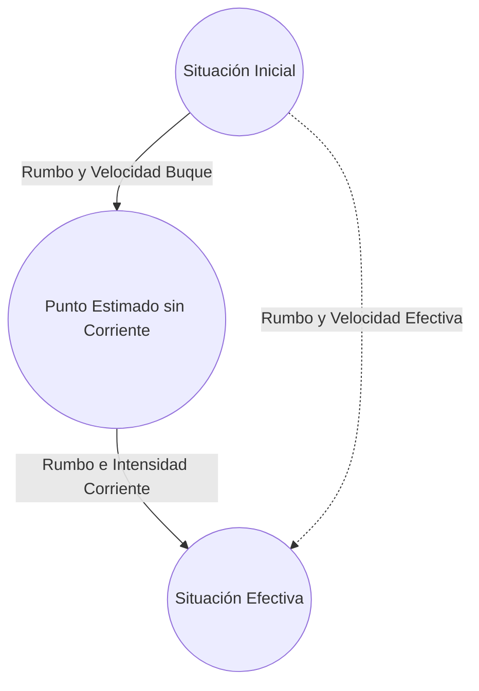

# Patrón de Yate - Tema 4: Navegación por Estima y Carta

El bloque de Navegación del Patrón de Yate (PY) es el filtro principal del examen. Requiere precisión milimétrica, soltura con la trigonometría y manejo experto de la carta del Estrecho de Gibraltar (Carta 105).

---

## 1. La Navegación por Estima Analítica (Fórmulas)

La estima es el método para conocer la situación del barco sumando al punto de partida el rumbo y la distancia navegada, sin usar referencias externas.

En Patrón de Yate, debes saber calcular esto matemáticamente.

### Conceptos Previos
*   **Diferencia de Latitud ($\Delta l$):** Distancia Norte-Sur entre dos puntos. (Norte +, Sur -).
*   **Diferencia de Longitud ($\Delta L$):** Distancia Este-Oeste en grados angulares. (Este +, Oeste -).
*   **Apartamiento (A):** La distancia física real Este-Oeste navegada (en millas náuticas). No es lo mismo que la Diferencia de Longitud porque los meridianos se juntan en los polos.
*   **Latitud Media ($l_m$):** Latitud promedio entre la salida y la llegada.

### Fórmulas de Loxodrómica (Navegación Plana)
Estas fórmulas asumen que para distancias cortas (menos de 300 millas) la Tierra se puede tratar como un plano.

Si conocemos nuestra situación de salida ($l_s$, $L_s$), el Rumbo Verdadero ($Rv$) y la Distancia navegada ($D$), calculamos el punto de llegada así:

1.  **Diferencia de Latitud:** 
    $$ \Delta l = D \cdot \cos(Rv) $$
    *(El resultado sale en minutos de grado, que equivalen a millas. Se suma a la $l_s$ para hallar la Latitud de llegada).*

2.  **Apartamiento:** 
    $$ A = D \cdot \sin(Rv) $$

3.  **Diferencia de Longitud:** 
    $$ \Delta L = \frac{A}{\cos(l_m)} $$
    *(Se suma a la $L_s$ para hallar la Longitud de llegada).*

### Cálculo Directo de Rumbo y Distancia
Si conocemos el punto de salida y el de llegada, y queremos saber qué rumbo directo poner y qué distancia hay:

1.  **Rumbo:**
    $$ \tan(Rv) = \frac{A}{\Delta l} $$
    *(¡Ojo a los cuadrantes al usar el arco tangente!)*

2.  **Distancia:**
    $$ D = \frac{\Delta l}{\cos(Rv)} \quad \text{o bien} \quad D = \frac{A}{\sin(Rv)} $$

---

## 2. Navegación con Abatimiento (Viento)

El viento empuja lateralmente el barco, desviándolo de la línea hacia donde apunta su proa.

*   **Abatimiento (Ab):** Ángulo de desvío.
    *   Si el viento empuja hacia Estribor: $Ab$ es positivo (+).
    *   Si el viento empuja hacia Babor: $Ab$ es negativo (-).

*   **Rumbo de Superficie (Rs):** El rumbo real por el que el barco avanza sobre la superficie del agua.
    $$ Rs = Rv + Ab $$

Para hallar el Rumbo de Aguja a poner en el timón conociendo el rumbo sobre el agua deseado:
    $$ Ra = Rs - Ab - Ct $$

---

## 3. Navegación con Deriva (Corriente Marina)

La masa de agua entera se mueve, llevándose el barco con ella.

*   **Rumbo de Corriente (Rc):** Dirección hacia la que va el agua (e.g., "Corriente hacia el SE" o 135º).
*   **Intensidad Horaria (Ihc):** Velocidad de la corriente en nudos.

### Problema Directo de Corrientes (Saber adónde vamos)
Trazado en la carta:
### Resolución Gráfica (Problema Directo)
Dado el Rumbo Verdadero, la Velocidad de la corredera, el Rumbo de la Corriente y su Intensidad Horaria:

1.  Trazar el vector de velocidad del barco desde nuestra situación.
2.  Desde el extremo de ese vector, trazar el vector de la corriente.
3.  Unimos el punto de salida original con la punta de la flecha de la corriente. Esa línea es nuestro **Rumbo Efectivo (Ref)**, y su longitud es nuestra **Velocidad Efectiva (Vef)**.

### Problema Inverso de Corrientes (Hallar el rumbo a poner)
Queremos ir al punto B, pero hay corriente. ¿A dónde debo apuntar la proa para que la corriente me arrastre exactamente hacia B?
1.  Unimos salida y llegada. Ese es nuestro **Rumbo Efectivo (Ref)** deseado.
2.  Desde la salida, trazamos el vector de corriente invertido (o directamente en sentido normal y operamos en el extremo) durante 1 hora.
3.  Desde la punta de la corriente, abrimos el compás con nuestra Velocidad de Máquina (Vb) y cortamos la línea del Rumbo Efectivo.
4.  La línea que une la punta de la corriente con el corte es el **Rumbo Verdadero (Rv)** que debemos mantener en el timón.
